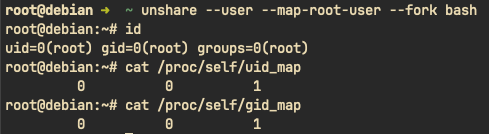

# 一、 容器：隔离与限制

很多人初识容器（比如 Docker），会觉得它像一个“轻量级的虚拟机”。但仔细探索它的本质：**其实就是宿主机上的一个普通进程，只是内核给它加了点“特效”**。

这些特效主要由两大内核特性 + 联合文件系统组成：

* **Namespace（命名空间）**：解决“谁能看到谁”的问题（逻辑隔离）。
* **Cgroups（控制组）**：解决“谁能用多少”的问题（资源配额）。
* **Contianer（容器）：等于 Namespace + Cgroups + 联合文件系统 (UnionFS)**。

---

# 二、 Namespace：构建隔离进程

Namespace 的本质是修改进程对系统资源的“看法”。目前 Linux 内核主要支持 **7 种核心的 Namespace**，它们共同构成了容器的隔离边界。

## 2.1 七大核心 Namespace 详解

### PID Namespace (进程隔离)：

* 作用：隔离进程 ID。
* 表现：在容器内部，主进程看到的 PID 是 1；但在宿主机视角下，它只是一个普通的、拥有真实 PID（如 1234）的子进程。这使得容器可以像独立系统一样管理自己的进程树。

### Network Namespace (网络隔离)：

* 作用：隔离网络设备、IP 地址、端口、路由表等。
* 表现：每个容器拥有虚构的 eth0 网卡和独立的 Loopback 设备。这是实现容器间网络互不干扰、端口不冲突的基础。

### Mount Namespace (文件系统隔离)：

* 作用：隔离挂载点视图。
* 表现：进程只能看到自己 Namespace 内挂载的文件系统。配合 chroot 或 pivot_root，它能让容器拥有完全独立的根目录结构（RootFS）。

### UTS Namespace (主机名隔离)：

* 作用：隔离主机名（Hostname）和域名（Domain name）。
* 表现：允许每个容器拥有独立的主机名，方便在分布式系统中进行标识。

### IPC Namespace (进程间通信隔离)：

* 作用：隔离 System V IPC 和 POSIX 消息队列。
* 表现：防止不同容器间的进程通过共享内存或信号量进行跨界通信，确保通信安全性。

### User Namespace (用户权限隔离)：

* 作用：隔离用户 ID 和组 ID（UID/GID）。
* 表现：这是最强大的安全特性之一。它允许容器内的 `root` 用户映射到宿主机上的一个普通用户。这意味着即使容器被攻破，攻击者在宿主机上也仅拥有受限权限。

### Cgroup Namespace (控制组视图隔离)：

* 作用：虚拟化 `/proc/self/cgroup` 文件。
* 表现：防止容器查看到宿主机的全量 Cgroup 层次结构，增强了信息的安全性。

## 2.2 Namespace 的内核接口

Linux 内核通过三个关键的系统调用（System Call）来管理 Namespace：

1. `clone()`：创建新进程时，通过传入特定的标志位（如 `CLONE_NEWPID`）来让子进程进入新的 Namespace。
2. `unshare()`：允许现有进程将自己从当前的 Namespace 中脱离，进入新创建的 Namespace。
3. `setns()`：允许进程“加入”一个已经存在的 Namespace（这是 `docker exec` 的核心原理）。

在 Linux 中，可以直接通过 `/proc` 伪文件系统观察到一个进程所属的所有 Namespace：

```shell
# 以当前 shell 进程为例
ls -l /proc/self/ns

zhangyan@debian ➜  ~ ls -l /proc/self/ns
total 0
lrwxrwxrwx 1 zhangyan zhangyan 0 Mar 21 15:50 cgroup -> 'cgroup:[4026531835]'
lrwxrwxrwx 1 zhangyan zhangyan 0 Mar 21 15:50 ipc -> 'ipc:[4026531839]'
lrwxrwxrwx 1 zhangyan zhangyan 0 Mar 21 15:50 mnt -> 'mnt:[4026531841]'
lrwxrwxrwx 1 zhangyan zhangyan 0 Mar 21 15:50 net -> 'net:[4026531840]'
lrwxrwxrwx 1 zhangyan zhangyan 0 Mar 21 15:50 pid -> 'pid:[4026531836]'
lrwxrwxrwx 1 zhangyan zhangyan 0 Mar 21 15:50 pid_for_children -> 'pid:[4026531836]'
lrwxrwxrwx 1 zhangyan zhangyan 0 Mar 21 15:50 time -> 'time:[4026531834]'
lrwxrwxrwx 1 zhangyan zhangyan 0 Mar 21 15:50 time_for_children -> 'time:[4026531834]'
lrwxrwxrwx 1 zhangyan zhangyan 0 Mar 21 15:50 user -> 'user:[4026531837]'
lrwxrwxrwx 1 zhangyan zhangyan 0 Mar 21 15:50 uts -> 'uts:[4026531838]'
```

可以看到这一系列类似 `ipc -> ipc:[4026531839]` 的链接。方括号里的数字就是 **Namespace ID**。如果两个进程的 ID 相同，说明它们同处于一个 Namespace 中。

> ⚠️注意：Namespace 虽然实现了强大的隔离，但它并非完美的“墙”。由于所有 Namespace 依然共享同一个 **Linux 内核**，因此它无法防止某些内核级别的攻击。因此在极高安全需求的场景下，可以结合 **Kata Containers** 这种“微型虚拟化”技术。

## 2.3 Namespace 实战：手动构建隔离空间

在我使用的 Debian 13 环境下，以 **root** 身份，使用 `util-linux` 软件包提供的 `unshare` 工具。它可以在不编写 C 代码的情况下，直接调用内核系统调用。

### 实验一：UTS 与 PID 隔离（主机名与进程树）

让一个进程拥有独立的主机名，并让它认为自己是系统中的 **PID 1**。

#### 1. 执行隔离命令：

```shell
# --uts: 隔离主机名
# --pid: 隔离进程号
# --fork: 让 unshare 创建一个子进程运行 bash，这对于 PID 隔离是必须的
# --mount-proc: 挂载一个新的 /proc 文件系统，否则 ps 命令依然会看到宿主机的进程
unshare --uts --pid --fork --mount-proc bash
```

#### 2. 验证隔离性：

修改主机名：
```shell
hostname container-lab
exec bash # 刷新 shell 提示符
hostname   # 输出: container-lab
```
此时开启另一个宿主机终端执行 `hostname`，会发现宿主机的主机名并未改变。

查看进程树：
```shell
ps aux

root@container-lab:~# ps aux
USER         PID %CPU %MEM    VSZ   RSS TTY      STAT START   TIME COMMAND
root           1  0.0  0.0   7348  4164 pts/0    S    17:08   0:00 bash
root           4  0.0  0.0   9396  4192 pts/0    R+   17:09   0:00 ps aux
```
结果显示，原本一大堆的进程消失了，当前的 bash 进程显示为 **PID 1**。

### 实验二：Mount 隔离（文件系统视图）

让进程拥有独立的挂载视图，这是容器 RootFS 的基础。

#### 1. 执行隔离命令：
```shell
unshare --mount bash
```

#### 2. 创建一个临时的挂载点：
```shell
mkdir /tmp/iso_mount
mount -t tmpfs none /tmp/iso_mount
df -h | grep iso_mount
```

#### 3. 宿主机对比验证：
在宿主机的另一个终端执行 `df -h`，完全看不到 `/tmp/iso_mount` 这个挂载点。

### 实验三：nsenter 进入Namespace

在日常开发调试中，经常需要进入一个运行中的容器。这背后的核心工具是 `nsenter`。

#### 1. 获取目标进程 PID 与 Namespace 信息：

先在宿主机找到实验一里那个 `unshare` 会话对应的 PID（不要写死 PID）：

```shell
TARGET_PID=24133
ls -l /proc/"${TARGET_PID}"/ns
```

#### 2. 加入该命名空间（UTS + PID + Mount）：
```shell
# -t: 指定目标进程 PID
# -u: 加入 UTS Namespace（主机名）
# -p: 加入 PID Namespace（进程号空间）
# -m: 加入 Mount Namespace（挂载视图）
# -F: --fork，创建子进程后再进入 PID Namespace
nsenter -t "${TARGET_PID}" -u -p -m -F bash
```

#### 3. 重新挂载 /proc（关键）并验证：

如果你在这个 shell 里直接执行 `ps aux` 出现：

```text
Error, do this: mount -t proc proc /proc
```

说明当前命名空间里的 `/proc` 还不是正确的 procfs 视图。执行：

```shell
mount -t proc proc /proc
ps aux
```

此时你会看到与实验一一致的进程视角（bash 通常是 PID 1 或接近 PID 1 的最小进程序列）。

### 实验四：Network Namespace（网络隔离）

让进程拥有独立的网络栈（网卡、路由、端口视图）。

#### 1. 进入新的网络命名空间：

```shell
unshare --net --fork bash
```

#### 2. 查看网络设备：

```shell
ip a
```

此时会看到只有 `lo`（回环网卡），并且可能是 DOWN 状态；宿主机上的 `eth0`/`ens*` 不会出现在这里。

#### 3. 启用回环网卡并验证：

```shell
ip link set lo up
ip a show lo
ping -c 2 127.0.0.1
```

如果 `ping` 成功，说明该命名空间内的本地网络栈可用；但它与宿主机网络视图仍是隔离的。

---

### 实验五：User Namespace（用户权限隔离）

验证“命名空间内看起来是 root，不等于宿主机 root”。

#### 1. 进入新的 User Namespace：

```shell
unshare --user --map-root-user --fork bash
```

> 如果系统报错 `Operation not permitted`，请先检查内核是否允许 unprivileged user namespace（不同发行版默认策略不同）。

#### 2. 查看身份与映射关系：

```shell
id
cat /proc/self/uid_map
cat /proc/self/gid_map
```



常见现象：

- `id` 显示当前用户是 `uid=0(root)`（命名空间内部视角）。
- `uid_map/gid_map` 显示它映射到宿主机的真实 UID/GID（外部视角）。

#### 3. 对比宿主机 Namespace ID：

在 User Namespace shell 与宿主机分别执行：

```shell
readlink /proc/self/ns/user
```

两边 ID 不同，说明确实已进入了新的 User Namespace。

> 关键理解：User Namespace 主要隔离的是“身份映射”。即便命名空间内显示 root，也不自动拥有宿主机的全局 root 权限。

---

# 三、 Cgroups

> 未完待续

识别 Linux 节点上的 cgroup 版本 

cgroup 版本取决于正在使用的 Linux 发行版和操作系统上配置的默认 cgroup 版本。 要检查你的发行版使用的是哪个 cgroup 版本，请在该节点上运行命令：
```sehll
stat -fc %T /sys/fs/cgroup/
```
对于 cgroup v2，输出为 cgroup2fs。
对于 cgroup v1，输出为 tmpfs。

