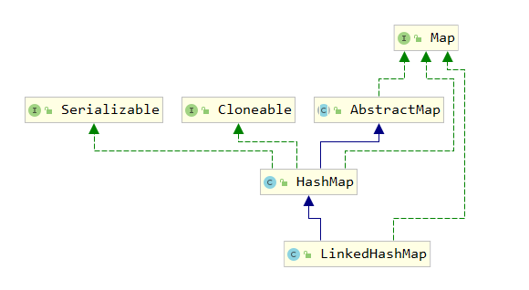
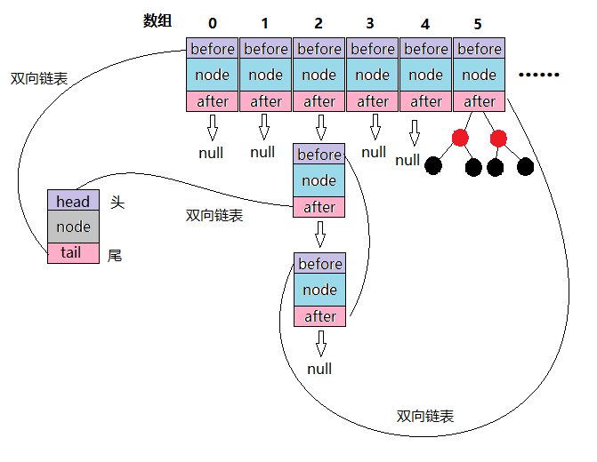

**`java.util.LinkedHashMap`** 类继承了 **`java.util.HashMap`** 类，实现了 **`java.util.Map`** 接口。



<!-- more -->

---

## 一、LinkedHashMap特点或规范

### 1.1 特点

**`java.util.LinkedHashMap`** 是 **`java.util.Map`** 接口的 **链表 + 哈希** 实现，具有可预测的迭代顺序；与 HashMap 的不同是在 HashMap 的基础上使用了双向链表的数据结构；并按照插入顺序排序。

**linkedHashMap 与 HashMap 比较：**

| 特性 | LinkedHashMap | HashMap |
| --- | --- | --- |
| 有序性 | 有序 | 无序 |
| 数据结构 | 数组 - 链表 - 红黑树 | 数组 - 链表 - 红黑树 + 双向链表 |
| 空键 | 允许 | 允许 |
| 空值 | 允许 | 允许 |

### 1.2 LRU缓存

**LinkedHashMap** 提供了一个特殊的构造函数来构建 **LRU 缓存**（Least Recent Used最近最少使用），构造器如下：

**`LinkedHashMap(int initialCapacity, float loadFactor, boolean accessOrder) { ... }`**

其关键参数是 **`accessOrder`**，其他构造器默认为 **`false`**，表示按照插入顺序进行排序；如果指定 **`true`**，表示按照最近访问顺序排序，LRU 缓存将会把最近最少使用的数据移除，将最近最常使用的数据 **移至链表最后**（迭代顺序从末尾开始）。

可以重写 **`removeEldestEntry(Map.Entry)`** 方法，以强制在添加新 Entry 时自动删除不满足条件的 Entry。

**<font color="red">注意</font>**：调用 **`put()`** / **`putAll()`** / **`putIfAbsent()`** / **`get()`** / **`getOrDefault()`** / **`replace()`** / **`compute()`** / **`computeIfAbsent()`** / **`computeIfPresent()`** / **`merge()`** 等方法也会对 Entry 进行访问，会对迭代顺序产生影响。

关于构建LRU缓存，见文章末尾：**<a href="#LRU">构建LRU缓存</a>**

### 1.3 数据结构 & 性能

**数据结构**：



LinkedHashMap 的数据结构在 HashMap 的基础上增加了 **双端链表** 的实现，与 HashMap 的 **哈希数组 + 链表或红黑树** 不冲突，同时存在。

**性能**：

- 由于需要额外维护一个双端链表，因此性能可能略低于 HashMap。
- 但对于 LinkedHashMap 的集合视图的迭代所需的时间与其的大小成正比，无论其容量多大。
- 对 HashMap 的迭代所需的时间与其容量成正比。

**<font color="red">注意</font>**：LinkedHashMap 类初始化时，选择过高的初始容量所导致的性能损耗 HashMap 严重，因为此类的迭代次数不受容量影响。

---

## 二、成员变量

```java
// 头节点，最老节点
transient LinkedHashMap.Entry<K,V> head;
// 尾节点，最新节点
transient LinkedHashMap.Entry<K,V> tail;
// 顺序访问开关
final boolean accessOrder;
```

---

## 三、构造器

### 3.1 遵循Map接口规范的构造器

**`java.util.Map`** 接口的构造器规范，提供一个 **无参构造器**，一个 **参数类型为 Map** 的构造器。调用父类 **`HashMap`** 的构造器，初始加载因子为默认值：0.75，其余值都为默认值。

```java
public LinkedHashMap() {
    super();
    accessOrder = false;
}
public LinkedHashMap(Map<? extends K, ? extends V> m) {
    super();
    accessOrder = false;
    putMapEntries(m, false);
}
```

### 3.2 继承自HashMap的构造器

支持指定 **初始容量**，加载因子为默认值：**0.75**

```java
public LinkedHashMap(int initialCapacity) {
    super(initialCapacity);
    accessOrder = false;
}
```

支持指定 **初始容量** 及 **加载因子**。

```java
public LinkedHashMap(int initialCapacity, float loadFactor) {
    super(initialCapacity, loadFactor);
    accessOrder = false;
}
```

### 3.3 自身构造器

```java
public LinkedHashMap(int initialCapacity, float loadFactor, boolean accessOrder) {
    super(initialCapacity, loadFactor);
    this.accessOrder = accessOrder;
}
```

---

## 四、方法分析

LinkedHashMap 大部分方法都沿用父类 HashMap 中的方法。

#### afterNodeAccess(E) 方法

每次发生访问调用后，将该 Entry 移动至链表末尾（tail），代表该 Entry 最近最长使用。

```java
void afterNodeAccess(Node<K,V> e) { // move node to last
    LinkedHashMap.Entry<K,V> last;
    if (accessOrder && (last = tail) != e) {
        LinkedHashMap.Entry<K,V> p =
            (LinkedHashMap.Entry<K,V>)e, b = p.before, a = p.after;
        p.after = null;
        if (b == null)
            head = a;
        else
            b.after = a;
        if (a != null)
            a.before = b;
        else
            last = b;
        if (last == null)
            head = p;
        else {
            p.before = last;
            last.after = p;
        }
        tail = p;
        ++modCount;
    }
}
```

#### afterNodeInsertion(boolean) 方法

添加新 Entry 后，判断是否需要删除最不常用（head）的 Entry。

```java
void afterNodeInsertion(boolean evict) { // possibly remove eldest
    LinkedHashMap.Entry<K,V> first;
    if (evict && (first = head) != null && removeEldestEntry(first)) {
        K key = first.key;
        removeNode(hash(key), key, null, false, true);
    }
}
```

#### afterNodeRemoval(Node) 方法

删除 Entry 后，断开该 Entry 的头尾链接。
```java
void afterNodeRemoval(Node<K,V> e) { // unlink
    LinkedHashMap.Entry<K,V> p = (LinkedHashMap.Entry<K,V>)e, b = p.before, a = p.after;
    p.before = p.after = null;
    if (b == null)
        head = a;
    else
        b.after = a;
    if (a == null)
        tail = b;
    else
        a.before = b;
}
```

#### linkNodeLast() 方法

将 Entry 链接至链表末尾。

```java
private void linkNodeLast(LinkedHashMap.Entry<K,V> p) {
    LinkedHashMap.Entry<K,V> last = tail;
    tail = p;
    if (last == null)
        head = p;
    else {
        p.before = last;
        last.after = p;
    }
}
```

#### transferLinks() 方法

将两个 Entry 调换位置。

```java
private void transferLinks(LinkedHashMap.Entry<K,V> src, LinkedHashMap.Entry<K,V> dst) {
    LinkedHashMap.Entry<K,V> b = dst.before = src.before;
    LinkedHashMap.Entry<K,V> a = dst.after = src.after;
    if (b == null)
        head = dst;
    else
        b.after = dst;
    if (a == null)
        tail = dst;
    else
        a.before = dst;
}
```

## <a name="LRU">五、构建LRU缓存</a>

```java
public class LRUCache<K, V> {
    private LinkedHashMap<K, V> map;
    private int cacheSize = 16;

    public LRUCache() {}
    public LRUCache(int cacheSize) {
        this.cacheSize = cacheSize;
        map = new LRULinkedHashMap<>(cacheSize);
    }

    public int size() { return cacheSize; }
    public synchronized V get(K key) { return map.get(key); }
    public synchronized Collection<Map.Entry<K, V>> getAll() {
        return new ArrayList<Map.Entry<K, V>>(map.entrySet());
    }
    public synchronized V put(K key, V value) { return map.put(key, value); }
    public synchronized void clear() { map.clear(); }
}
```

### LRULinkedHashMap自定义Map类

```java
/**
 * LRULinkedHashMap，继承自 LinkedHashMap，实现了 LRU 功能，删除最近最少使用的元素。
 * <p>
 * 仅提供了唯一构造器，因 LinkedHashMap 只提供了一个可构造访问顺序排序的构造器，
 * 所以此类没有遵循 Map 接口的构造器规范，及各父类的构造器规范。
 * <p>
 * 重写了 removeEldestEntry 方法，提供删除最老 Entry 的条件。
 *
 * @author zhang.yan
 * @see Map
 * @see HashMap
 * @see LinkedHashMap
 */
public class LRULinkedHashMap<K, V> extends LinkedHashMap<K, V> {

    private int capacity;
    private static final int DEFAULT_INITIAL_CAPACITY = 16;
    private static final float DEFAULT_LOAD_FACTOR = 0.75f;

    public LRULinkedHashMap() {
        super(DEFAULT_INITIAL_CAPACITY, DEFAULT_LOAD_FACTOR, true);
        this.capacity = DEFAULT_INITIAL_CAPACITY;
    }

    public LRULinkedHashMap(int initialCapacity) {
        super(initialCapacity, DEFAULT_LOAD_FACTOR, true);
        this.capacity = initialCapacity;
    }

    public LRULinkedHashMap(int initialCapacity, float loadFactor) {
        super(initialCapacity, loadFactor, true);
        this.capacity = initialCapacity;
    }

    @Override
    protected boolean removeEldestEntry(Map.Entry<K, V> eldest) {
        return size() > capacity;
    }
}
```

