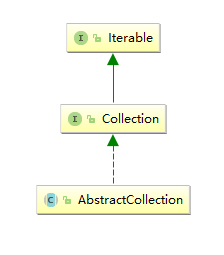

**`java.util.AbstractCollection`** 抽象类实现了 **`java.util.Collection`** 接口。



<!-- more -->

## 一、AbstractCollection类继承规范

- **`AbstractCollection`** 抽象类提供了 **`Collection`** 接口的骨干实现，以最大限度地减少实现 **`Collection`** 接口所需的工作量。
- 如需实现一个 **不可修改的集合**，只需要继承此类并提供 **`iterator()`** 方法和 **`size()`** 方法的实现。（**`iterator()`** 方法返回的迭代器必须实现 **`hasNext()`** 方法和 **`next()`**方法。）
- 如需实现一个 **可修改的集合**，则必须另外覆盖此类的 **`add()`** 方法（否则会抛出 `UnsupportedOperationException` 异常），**`iterator()`** 方法返回的迭代器必须另外实现其 **`remove()`** 方法。
- 除此之外还应该根据 **`Collection`** 接口的规范提供 **无参数构造器** 和 **参数为 Collection 的构造器**。
- 每个非抽象的方法都有自己的实现，如果子类需要特殊的实现，则可以覆盖对应的方法。

---

## 二、成员分析

### 2.1 常量

集合的最大数组大小。某些虚拟机在数组中保留一些 `header words`。如果尝试分配更大的数组可能会导致 `OutOfMemoryError`：请求的数组大小超过VM限制。
```java
private static final int MAX_ARRAY_SIZE = Integer.MAX_VALUE - 8;
```

### 2.2 构造方法

唯一的构造函数。
```java
protected AbstractCollection() {
}
```

### 2.3 抽象方法

方法描述见：<a href="/blog/2019/07/15/javase/Collection-source-analysis/">**`java.util.Collection`**</a> 接口。
```java
public abstract Iterator<E> iterator();
public abstract int size();
```

### 2.4 实现方法

#### isEmpty()方法

如果挡墙集合不包含任何元素，则返回 **`true`**。依赖子类实现的 **`size()`** 方法，判断size是否等于0。
```java
public boolean isEmpty() {
    return size() == 0;
}
```

#### contains(Object o)方法

如果当前集合中包含指定的元素，则返回 **`true`**。
即：当且仅当此集合包含至少一个元素e时才返回true，**`(o == null ? e == null : o.equals(e))`**。
此实现迭代集合中的元素，依次检查每个元素是否与指定元素相等。
iterator()方法依赖子类的实现。
```java
public boolean contains(Object o) {
    Iterator<E> it = iterator();
    if (o == null) {
        while (it.hasNext())
            if (it.next() == null)
                return true;
    } else {
        while (it.hasNext())
            if (o.equals(it.next()))
                return true;
    }
    return false;
}
```

#### toArray()方法

返回包含当前集合中所有元素的数组。
如果当前集合的迭代器返回的元素是有序的，则此方法必须以相同的顺序返回元素数组。
当前集合不会保留对数组中元素的引用，所以返回的数组是“安全的”。
此方法充当基于数组和基于集合的API之间的桥梁。
```java
public Object[] toArray() {
    // 初始化数组的大小
    Object[] r = new Object[size()];
    Iterator<E> it = iterator();
    for (int i = 0; i < r.length; i++) {
        if (!it.hasNext()) // 元素少于预期的大小
            return Arrays.copyOf(r, i);
        r[i] = it.next();
    }
    return it.hasNext() ? finishToArray(r, it) : r;
}
```

#### toArray(T[] a)方法

返回包含当前集合中所有元素的数组，并按照类型放入指定数组 **a** 中。如果数组 `length` 小于当前集合，则创建一个新的数组并放入集合中的元素。
```java
public <T> T[] toArray(T[] a) {
    // 预估数组的大小为集合的 size
    int size = size();
    // 如果数组 a 的长度小于 size，则反射一个 size 大小的数组
    T[] r = a.length >= size ? a :
              (T[])java.lang.reflect.Array
              .newInstance(a.getClass().getComponentType(), size);
    Iterator<E> it = iterator();
    for (int i = 0; i < r.length; i++) {
        if (! it.hasNext()) { // 元素少于预期的大小
            if (a == r) {
                r[i] = null;
            } else if (a.length < i) {
                return Arrays.copyOf(r, i);
            } else {
                System.arraycopy(r, 0, a, 0, i);
                if (a.length > i) {
                    a[i] = null;
                }
            }
            return a;
        }
        r[i] = (T)it.next();
    }
    // 元素大于预期的大小
    return it.hasNext() ? finishToArray(r, it) : r;
}
```

#### finishToArray(T[] r, Iterator<?> it)方法

当迭代器返回的元素多于预期时，则重新分配在 **`toArray`** 中使用的数组，并完成从迭代器填充它。

迭代器每次迭代到下一个元素时，判断 **`cap`** 数组的长度等于 **`i`** 当前迭代的元素数量，就将 cap 数组的长度增加 **`cap x 1.5 + 1`**，并判断是否超出了虚拟机最大限制，如果超出限制就调用 **`hugeCapacity()`** 方法调整大小。
```java
private static <T> T[] finishToArray(T[] r, Iterator<?> it) {
    int i = r.length;
    while (it.hasNext()) {
        int cap = r.length;
        if (i == cap) {
            int newCap = cap + (cap >> 1) + 1;
            // 检测大小是否溢出
            if (newCap - MAX_ARRAY_SIZE > 0)
                newCap = hugeCapacity(cap + 1);
            r = Arrays.copyOf(r, newCap);
        }
        r[i++] = (T)it.next();
    }
    // 修剪过度分配
    return (i == r.length) ? r : Arrays.copyOf(r, i);
}
```

#### hugeCapacity(int minCapacity)方法

调整最大容量，如果小于0，抛出 **`OutOfMemoryError`** 异常，如果大于虚拟机最大限制，则设置为常量 **`MAX_ARRAY_SIZE`**。
```java
private static int hugeCapacity(int minCapacity) {
    if (minCapacity < 0) // overflow
        throw new OutOfMemoryError
            ("Required array size too large");
    return (minCapacity > MAX_ARRAY_SIZE) ?
        Integer.MAX_VALUE :
        MAX_ARRAY_SIZE;
}
```

#### add(E e)方法

- **AbstractCollection** 没有提供 add() 方法的具体实现，只提供子类实现的规范，始终抛出 **`UnsupportedOperationException`** 异常。
- 如果添加成功（集合因调用导致改变），则返回 **`true`**。
- 如果此集合不允许重复且已包含指定的元素 e ，则返回 **`false`**。
- 某些子类实现的集合不允许添加 **`null`** 元素，或集合对添加的元素有 **类型限制**。
- 如果集合因已包含该元素而拒绝添加特定元素 e，则必须 **抛出异常，而不是返回 `false`**。以保证在此调用后集合始终保持不变。

```java
public boolean add(E e) {
    // 不支持的操作类型
    throw new UnsupportedOperationException();
}
```

#### remove(Object o)方法

- 从当前集合中移除指定元素的第一个出现的实例（如果存在）。
- 此子类实现的 **`iterator()`** 方法查找指定的元素。如果找到该元素，则由此迭代器的 **`remove()`** 方法从集合中删除该元素。
- **注意**：如果当前子类实现的 `iterator()` 方法返回的迭代器未实现 `remove()` 方法，且当前集合包含了指定的对象，则抛出 **`UnsupportedOperationException`** 异常。

```java
public boolean remove(Object o) {
    Iterator<E> it = iterator();
    // 判断 o 对象是否为 null，某些子类实现允许包含 null 元素，则需要提供对 null 元素进行删除
    if (o == null) {
        while (it.hasNext())
            if (it.next() == null)
                it.remove();
                return true;
    } else {
        while (it.hasNext())
            if (o.equals(it.next()))
                it.remove();
                return true;
    }
    return false;
}
```

#### containsAll(Collection<?> c)方法

如果当前集合包含指定 Collection 中的所有元素，则返回 **`true`**。
```java
public boolean containsAll(Collection<?> c) {
    for (Object e : c)
        if (!contains(e))
            return false;
    return true;
}
```

#### addAll(Collection<? extends E> c)方法

将指定集合中的所有元素条件至当前集合中，此方法依赖 **`add()`** 方法。
```java
public boolean addAll(Collection<? extends E> c) {
    boolean modified = false;
    for (E e : c)
        if (add(e))
            // 只要 c 集合发生改变，就将 modified 置为 true
            modified = true;
    return modified;
}
```

#### removeAll(Collection<?> c)方法

从当前集合，删除指定集合 c 中的全部元素，且该指定的集合不可为 null。
**注意**：如果当前子类实现的 `iterator()` 方法返回的迭代器未实现 `remove()` 方法，且当前集合包含了指定的对象，则抛出 **`UnsupportedOperationException`** 异常。
```java
public boolean removeAll(Collection<?> c) {
    Objects.requireNonNull(c);
    boolean modified = false;
    Iterator<?> it = iterator();
    while (it.hasNext()) {
        if (c.contains(it.next())) {
            it.remove();
            // 只要 c 集合发生改变，就将 modified 置为 true
            modified = true;
        }
    }
    return modified;
}
```

#### retainAll(Collection<?> c)方法

仅保留当前集合包含了指定集合 c 中的元素，即：删除当前集合中不包含指定集合 c 中的元素。
**注意**：如果当前子类实现的 `iterator()` 方法返回的迭代器未实现 `remove()` 方法，且当前集合包含了指定的对象，则抛出 **`UnsupportedOperationException`** 异常。
```java
public boolean retainAll(Collection<?> c) {
    Objects.requireNonNull(c);
    boolean modified = false;
    Iterator<E> it = iterator();
    while (it.hasNext()) {
        if (!c.contains(it.next())) {
            it.remove();
            // 只要 c 集合发生改变，就将 modified 置为 true
            modified = true;
        }
    }
    return modified;
}
```

#### clear()方法

**清空集合**，将当前集合中的全部元素删除。子类实现通常会以 **高效的实现** 来覆盖此方法。
**注意**：如果当前子类实现的 `iterator()` 方法返回的迭代器未实现 `remove()` 方法，且当前集合包含了指定的对象，则抛出 **`UnsupportedOperationException`** 异常。
```java
public void clear() {
    Iterator<E> it = iterator();
    while (it.hasNext()) {
        it.next();
        it.remove();
    }
}
```

#### toString()方法

返回当前集合的字符串表现形式，按照迭代器返回的顺序进行字符串拼接。
覆盖 **`Object`** 的 **`toString()`** 方法，以 **`[`** 开始，以 **`]`** 结束，相邻元素以 **`, `** 逗号 + 空格来间隔，元素调用 **`String.valueOf(Object)`** 转换字符串形式。
```java
public String toString() {
    Iterator<E> it = iterator();
    if (!it.hasNext())
        return "[]"; // 空集合
    StringBuilder sb = new StringBuilder();
    sb.append('['); // 开始
    for (;;) {
        E e = it.next();
        sb.append(e == this ? "(this Collection)" : e);
        if (!it.hasNext())
            return sb.append(']').toString(); // 结束
        sb.append(',').append(' '); // 元素间隔
    }
}
```
