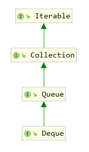

**`java.util.Deque`** 接口直接继承自 **`java.util.Queue`** 接口。



<!-- more -->

## 一、Deque接口特点或规范

- **`Deque`** 是**线性集合**，最大的特点是支持 **两端插入、移除元素**。Deque 是 "double ended queue" 的缩写。
- 大多数 Deque 的子类实现对其包含的元素数量没有固定限制，但此接口支持：
  - 支持容量限制的子类实现。
  - 支持没有容量限制子类实现。
- 支持访问双端队列两端的元素。
- 提供额外的 **插入**，**提取** 和 **检查** 三组操作。其中每组都以两种形式存在：
  - 一种在操作**失败时抛出异常**。
  - 一种**返回特殊值**（**`null`** 或 **`false`**，具体取决于操作），此形式的插入操作专门用于**容量限制的队列实现**；在大多数实现中，插入操作不会失败。

### 1.1 Deque 双端队列十二种方法摘要：

|  | 第一个元素(Head) |  | 最后一个元素(Tail) |  |
| --- | --- | --- | --- | --- |
|  | **抛出异常** |	**返回特殊值** | **抛出异常** | **返回特殊值** |
| **插入** | addFirst(e) | offerFirst(e) | addLast(e) | offerLast(e) |
| **删除** | removeFirst() | pollFirst() | removeLast() | pollLast() |
| **获取** | getFirst() | peekFirst() | getLast() | peekLast() |

### 1.2 当做 Queue 使用

- 当 **Deque** 用作 **队列** 时，会使用 **FIFO（先进先出）** 结构。
- 元素在双端队列的 **末尾添加** 并 **从头开始删除**。
- 从 Queue 接口继承的方法与 Deque 的方法完全等效，如下表所示：

| Queue 方法 | 等效于 Deque 方法 |
| --- | --- |
| add(e) | addLast(e) |
| offer(e) | offerLast(e) |
| remove() | removeFirst() |
| poll() | pollFirst() |
| element() | getFirst() |
| peek() | peekFirst() |

### 1.3 当做 Stack 栈使用

- **Deque** 也可以用作 **LIFO（后进先出）栈**。
- 需要 **栈** 结构时，应**优先使用**此接口的实现类，而不是传统的 **`java.util.Stack`** 类。
- 当 **Deque** 用作**栈**时，元素将从双端队列的开头推出并弹出。
- Stack 方法与 Deque 方法完全等效，如下表所示：

| Stack 方法 | 等效于 Deque 方法 |
| --- | --- |
|push(e) | addFirst(e) |
|pop() | removeFirst() |
|peek() | peekFirst() |

请注意，当 Deque 用作 **队列** 或 **栈** 时，**`peek()`** 方法同样有效，在任何情况下，元素都是从双端队列的开头获取的。

### 1.4 删除内部元素

Deque 接口提供了两种方法来 **删除内部元素**，**`removeFirstOccurrence()`** 和 **`removeLastOccurrence()`**。

### 1.5 不支持随机访问

与List接口不同，此接口不支持对元素的索引访问。

### 1.6 插入null值规范

Deque 严格禁止插入 **`null`** 元素，建议任何子类实现遵循此规范。因为 **`null`** 用作各方法的特殊返回值，用来表示 Deque 为空。

### 1.7 equals()和hashCode()

队列实现通常不定义基于元素的 **`equals()`** 和 **`hashCode()`** 方法，而是基于当前队列从 **`Object`** 类继承，因为基于元素的相等并不总是为具有相同元素但具有不同排序属性的队列定义良好。

---

## 二、继承自 Collection 的方法

```java
// 删除第一次出现的元素 o
boolean remove(Object o);
// 是否包含元素 o
boolean contains(Object o);
// 获取双端队列大小
public int size();
// 获取迭代器
Iterator<E> iterator();
```

---

## 三、继承自 Queue 的方法

用作 Queue 队列使用时，相关方法。
```java
// 添加
boolean add(E e);
boolean offer(E e);

// 删除
E remove();
E poll();

// 获取
E element();
E peek();
```

---

## 四、Stack 栈相关方法

用作 Stack 栈使用时，相关方法。

#### push(E) 压栈

不超出容量限制的情况下立即执行 **压栈** 操作，即将元素推送到此双端队列的**头部**，如果当前没有可用空间，则抛出 **`IllegalStateException`** 异常。
```java
void push(E e);
```

#### pop() 出栈、弹栈

从此 Deque 栈中弹出一个元素，即：删除并返回此 Deque 栈的第一个元素。
```java
E pop();
```

---

## 五、Deque 方法描述

```java
// 从头开始添加一个元素 e
void addFirst(E e);
// 从尾开始添加一个元素 e
void addLast(E e);
// 从头开始添加一个元素 e，并返回是否添加成功
boolean offerFirst(E e);
// 从尾开始添加一个元素 e，并返回是否添加成功
boolean offerLast(E e);

// 从头开始删除第一个元素，并返回该元素
E removeFirst();
// 从尾开始删除第一个元素，并返回该元素
E removeLast();
// 从头开始删除第一个元素，并返回该元素
E pollFirst();
// 从尾开始删除第一个元素，并返回该元素
E pollLast();

// 获取但不删除第一个元素，如果此双端队列为空，则抛出异常
E getFirst();
// 获取但不删除最后一个元素，如果此双端队列为空，则抛出异常
E getLast();
// 获取但不删除第一个元素，如果此双端队列为空，则返回null
E peekFirst();
// 获取但不删除最后一个元素，如果此双端队列为空，则返回null
E peekLast();

// 从双端队列中删除第一次出现的元素 o
boolean removeFirstOccurrence(Object o);
// 从双端队列中删除最后一次出现的元素 o
boolean removeLastOccurrence(Object o);

// 以倒序返回此双端队列中元素的迭代器，元素将按从最后（尾部）到第一个（头部）的顺序返回
Iterator<E> descendingIterator();
```
