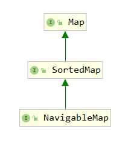

**`java.util.NavigableMap`** 接口直接继承自 **`java.util.SortedMap`** 接口。



<!-- more -->

## 一、NavigableMap特点或规范

**`NavigableMap`** 使用可导航的方法扩展了 **`SortedMap`**，返回给定搜索目标的最接近匹配结果。

**`NavigableMap`** 定义了以下方法来根据 key 查询，如果不存在该 key，则返回 **`null`**：

| 操作 | 小于 | 小于等于 | 大于等于 | 大于 |
| --- | --- | --- | --- | --- |
| 查询满足条件的 Map.Entry | **`lowerEntry(K)`** | **`floorEntry(K)`** | **`ceilingEntry(K)`** | **`higherEntry(K)`** |
| 查询满足条件的 key | **`lowerKey(K)`** | **`floorKey(K)`** | **`ceilingKey(K)`** | **`higherKey(K)`** |

### 有序性

- 可以按 **升序** 或 **降序** key 访问或遍历 **NavigableMap**。
- **`descendingMap()`** 方法返回 Map 的反序视图。
- **`navigableKeySet()`** 方法返回 key 的 **升序** 视图
- **`descendingKeySet()`** 方法返回 key 的 **降序** 视图
- 升序操作及视图的性能 可能比 降序操作及视图的性能 **更快**。

### 子Map视图

子 Map 视图继承自 SortedMap，两种实现不同之处在于 **是否可接受包含下限和上限参数**。**NavigableMap** 返回的子视图也都必须实现 NavigableMap 接口。

| 返回值类型 | fromKey -> toKey | head -> toKey | fromKey -> tail |
| --- | --- | --- | --- |
| **SortedMap<K,V>** | **`subMap(K fromKey, K toKey)`** | **`headMap(K toKey)`** | **`tailMap(K fromKey)`** |
| **NavigableMap<K,V>** | **`subMap(K fromKey, boolean fromInclusive, K toKey, boolean toInclusive)`** | **`headMap(K toKey, boolean inclusive)`** | **`tailMap(K fromKey, boolean inclusive)`** |


### 双端操作

**NavigableMap** 支持双端操作，返回 **`Map.Entry<K, V>`** ，如果不存在则返回 **`null`**。

| 起始位置 | 仅获取 | 获取并删除 |
| --- | --- | --- |
| 头 | **`firstEntry()`** | **`pollFirstEntry()`** |
| 尾 | **`lastEntry()`** | **`pollLastEntry()`** |

---

## 二、方法描述

### 2.1 NavigableMap中的方法

```java
Map.Entry<K,V> lowerEntry(K key);
Map.Entry<K,V> floorEntry(K key);
Map.Entry<K,V> ceilingEntry(K key);
Map.Entry<K,V> higherEntry(K key);

K lowerKey(K key);
K floorKey(K key);
K ceilingKey(K key);
K higherKey(K key);

Map.Entry<K,V> firstEntry();
Map.Entry<K,V> lastEntry();
Map.Entry<K,V> pollFirstEntry();
Map.Entry<K,V> pollLastEntry();

NavigableMap<K,V> descendingMap();

NavigableSet<K> navigableKeySet();
NavigableSet<K> descendingKeySet();

NavigableMap<K,V> subMap(K fromKey, boolean fromInclusive, K toKey, boolean toInclusive);
NavigableMap<K,V> headMap(K toKey, boolean inclusive);
NavigableMap<K,V> tailMap(K fromKey, boolean inclusive);
```

### 2.2 继承自SortedMap的方法

```java
// 返回子 Map，包含头不包含尾
SortedMap<K,V> subMap(K fromKey, K toKey);
// 返回子 Map，子 Map 小于 toKey
SortedMap<K,V> headMap(K toKey);
// 返回子 Map，子 Map 大于等于 fromKey
SortedMap<K,V> tailMap(K fromKey);
```
