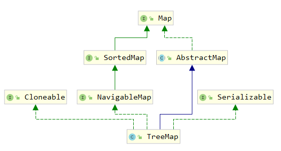

**`java.util.TreeMap`** 类继承了 **`java.util.AbstractMap`** 抽象类，实现了 **`java.util.NavigableMap`**、**`java.lang.Cloneable`**、**`java.io.Serializable`** 接口。



<!-- more -->

---

## 一、TreeMap特点或规范

**`TreeMap`** 是基于 **<a href="/blog/2019/09/11/javase/HashMap-TreeNode/">红黑树</a>** 的 **NavigableMap** 实现。根据其 key 的 **自然顺序** 进行排序，或者根据使用的构造器在 Map 创建时提供的比较器进行排序。

由于底层采用了红黑树的数据结构，因此 TreeMap 的查询方法，如：**`containsKey()`**，**`get()`**，**`put()`**，**`remove()`**，其时间复杂度均为：**O(logn)**。

<font color="red">注意</font>：**TreeMap** 不同步。
如果多个线程同时访问，并且至少有一个线程进行了结构上的修改，则必须在外部进行同步；如下：

**`SortedMap m = Collections.synchronizedSortedMap(new TreeMap(...));`**

<font color="red">注意</font>：此类中的方法返回的所有 **`Map.Entry`** 都它们不支持 **`Entry.setValue()`** 方法；可以使用 **`put(K, V)`** 方法更改 **Entry** 中的值。

---

## 二、成员变量

### 2.1 常量

```java
// 虚拟值
private static final Object UNBOUNDED = new Object();
// 表示红色节点
private static final boolean RED   = false;
// 表示黑色节点
private static final boolean BLACK = true;
// 指定 Map 中的比较器
private final Comparator<? super K> comparator;
```

### 2.2 变量

```java
// 红黑树的根节点
private transient Entry<K,V> root;
// Map 的大小
private transient int size = 0;
// Map 的修改次数
private transient int modCount = 0;
// 实体集合
private transient EntrySet entrySet;
// 可导航的所有的键的集合
private transient KeySet<K> navigableKeySet;
// 倒序的 Map
private transient NavigableMap<K,V> descendingMap;
```

---

## 三、构造器

### 3.1 遵循Map接口的构造器规范

```java
// 空参构造器
public TreeMap() {
    comparator = null;
}
// 参数类型为 Map 的构造器
public TreeMap(Map<? extends K, ? extends V> m) {
    comparator = null;
    putAll(m);
}
```

### 3.2 遵循SortedMap接口的构造器规范

```java
// 参数类型为 Comparator 的构造器，指定比较器
public TreeMap(Comparator<? super K> comparator) {
    this.comparator = comparator;
}
// 参数为 SortedMap 的构造器，沿用该 SortedMap 中的比较器
public TreeMap(SortedMap<K, ? extends V> m) {
    comparator = m.comparator();
    try {
        buildFromSorted(m.size(), m.entrySet().iterator(), null, null);
    } catch (java.io.IOException cannotHappen) {
    } catch (ClassNotFoundException cannotHappen) {
    }
}
```

---

## 四、方法分析

**TreeMap** 中的方法分为以下几类。

### 4.1 实现自Map接口的方法

见：<a href="/blog/2019/08/21/javase/Map-source-analysis/">java.util.Map</a>

### 4.2 实现自SortedMap接口的方法

见：<a href="/blog/2019/08/27/javase/SortedMap-source-analysis/">java.util.SortedMap</a>

### 4.3 实现自NavigableMap接口的方法

见：<a href="/blog/2019/08/28/javase/NavigableMap-source-analysis/">java.util.NavigableMap</a>

### 4.4 继承自AbstractMap接口的方法

见，<a href="/blog/2019/09/02/javase/AbstractMap-source-analysis/">java.util.AbstractMap</a>

### 4.5 TreeMap自身方法

**TreeMap** 中的大部分方法与 **HashMap.TreeNode** 内部类相似，都使用了 **<font color="red">红</font>黑树** 结构，**变色**、**左旋**、**右旋** 等基本操作也十分相似。

见：<a href="/blog/2019/09/11/javase/HashMap-TreeNode/">HashMap.TreeNode</a>
