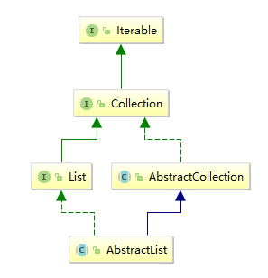
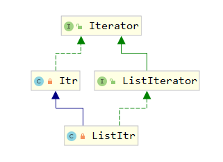

**`java.util.AbstractList`** 抽象类继承了 **`java.util.AbstractCollection`** 类，实现了 **`java.util.List`** 接口。



<!-- more -->

## 一、AbstractList类继承规范

#### 随机访问性与顺序访问性规范
- **`AbstractList`** 类提供了 **`List`** 接口的基础实现，以最大限度地减少子类且实现了 **“随机访问”** 数据存储（如：数组）所需的工作量（如：**`ArrayList`**）。
- 对于顺序访问的数据结构（如：**`LinkedList`**），应该优先使用 **`java.util.AbstractSequentialList`**，而不是此类。

#### 可修改性规范
- 如果要实现不可修改的列表，子类只需要扩展此类并提供 **`get(int)`** 方法和 **`size()`** 方法的实现。
- 如果要实现可修改的列表，子类必须另外覆盖 **`set(int, E)`** 方法，否则会抛出 **`UnsupportedOperationException`** 异常。

#### 大小可变性规范
- 如果列表是 **size** 是可变的，则子类必须另外覆盖 **`add(int, E)`** 方法和 **`remove(int)`** 方法，**`add(E)`** 方法已提供实现，元素默认加入列表末尾。

#### 子类构造器规范
- 子类应根据 **`Collection`** 接口的规范提供 **无参数构造器** 和 **参数为 Collection 的构造器**。

#### 迭代器规范
- 与其他抽象集合实现不同，子类不必提供迭代器实现；**迭代器（通常是：`Itr`）** 和 **列表迭代器（通常是：`ListItr`）** 是由这个类的 **“随机访问”** 方法实现的：**`get(int) set(int, E) add(int, E) remove(int)`**。

#### 可覆盖性规范
- 此类中每个非抽象方法的实现。子类都可以以更高效的方式或特有的方式进行覆盖。

---

## 二、成员分析

### 2.1 成员属性

当前列表已被 **结构修改** 的次数。
**结构修改**：是改变列表大小 或 以其他方式扰乱它的方式，即：正在进行的迭代可能产生不正确的结果。

该字段由 **`iterator()`** 方法返回的 **迭代器** 和 **`listIterator()`** 方法返回 **列表迭代器** 使用。
非线程安全，如果此字段的值意外更改，迭代器或列表迭代器将抛出 **`ConcurrentModificationException`** 异常。

**快速失败**
- 如果子类实现提供快速失败的迭代器（并列出迭代器），则只需要在其 **`add(int, E)`** 方法和 **`remove(int)`** 方法中增加该字段的值，单次调用增加的值不能超过 **1**，否则抛出 **`ConcurrentModificationException`** 异常。
- 如果子类实现不提供快速失败的迭代器，则可以忽略此字段。

```java
protected transient int modCount = 0;
```

### 2.2 构造方法

唯一的构造器。**Collection** 的构造器规范由子类实现。
```java
protected AbstractList() {
}
```

### 2.3 抽象方法

唯一的一个抽象方法，为调用者提供索引访问的方法。来自 **java.util.List** 接口。
```java
abstract public E get(int index);
```

### 2.4 实现方法

#### set()可修改性方法

如果子类要实现一个 **可修改** 的列表，则必须覆盖此方法，提供可根据索引修改元素。来自 **java.util.List** 接口。
```java
public E set(int index, E element) {
    throw new UnsupportedOperationException();
}
```

#### add()、remove()大小可变性方法

如果子类要实现一个 **大小可变** 的列表，则必须覆盖 **`add(int, E)`** 方法和 **`remove(int)`** 方法。均来自 **java.util.List** 接口。
```java
// 添加单个元素
public boolean add(E e) {
    // 默认加入列表末尾
    add(size(), e);
    return true;
}

// 插入指定索引位置
public void add(int index, E element) {
    throw new UnsupportedOperationException();
}

// 根据索引删除指定位置的元素
public E remove(int index) {
    throw new UnsupportedOperationException();
}
```

#### indexOf()正序搜索

返回此列表中第一次出现的指定元素的索引，如果当前列表不包含该元素，则返回-1。来自 **java.util.List** 接口。
即：返回**最低索引**。
```java
public int indexOf(Object o) {
    ListIterator<E> it = listIterator();
    if (o == null) {
        while (it.hasNext())
            if (it.next() == null)
                return it.previousIndex();
    } else {
        while (it.hasNext())
            if (o.equals(it.next()))
                return it.previousIndex();
    }
    return -1;
}
```

#### lastIndexOf()倒序搜索

返回此列表中最后一次出现的指定元素的索引，如果当前列表不包含该元素，则返回-1。来自 **java.util.List** 接口。
即：返回**最高索引**。
```java
public int lastIndexOf(Object o) {
    ListIterator<E> it = listIterator(size());
    if (o == null) {
        while (it.hasPrevious())
            if (it.previous() == null)
                return it.nextIndex();
    } else {
        while (it.hasPrevious())
            if (o.equals(it.previous()))
                return it.nextIndex();
    }
    return -1;
}
```

#### clear()、removeRange(int, int)方法

清空列表中的全部元素。
```java
public void clear() {
    removeRange(0, size());
}

// 按照指定范围删除元素，操作包含头不包含尾。
protected void removeRange(int fromIndex, int toIndex) {
    // 定义迭代器起始位置
    ListIterator<E> it = listIterator(fromIndex);
    // 计算迭代器结束位置 = toIndex - fromIndex
    for (int i = 0, n = toIndex - fromIndex; i < n; i++) {
        it.next();
        it.remove();
    }
}
```

#### addAll(int, Collection)方法

- 将**指定集合**中的**所有元素**插入到**当前列表**的**指定位置**中。
- 新添加的元素将按照**指定集合**的迭代器返回的顺序插入至此列表中。
- 此实现使用 **`add(int, E)`** 方法，一次一个的插入。子类实现可覆盖此方法以提高效率。
- 注意，除非重写 **`add(int, E)`**，否则会抛出 **`UnsupportedOperationException`** 异常。

```java
public boolean addAll(int index, Collection<? extends E> c) {
    rangeCheckForAdd(index);
    boolean modified = false;
    for (E e : c) {
        add(index++, e);
        modified = true;
    }
    return modified;
}

// 检查添加位置
private void rangeCheckForAdd(int index) {
    // 起始位置至少从0开始，不能大于size
    if (index < 0 || index > size())
        throw new IndexOutOfBoundsException(outOfBoundsMsg(index));
}

// 越界异常提示信息
private String outOfBoundsMsg(int index) {
    return "Index: "+index+", Size: "+size();
}
```

#### equals(Object)方法

将指定对象与当前列表进行比较。如果指定的对象类型为 **List**，且两个列表大小相同，且两个列表中的所有元素的 **equals()** 方法相等，顺序相等，才返回 **`true`**。

- 此实现方法首先检查指定的对象是否为当前列表：
  - 如果是，则返回 **`true`**。
  - 如果不是，则检查指定的对象类型是否是列表：
    - 如果不是，则返回 **`false`**。
    - 如果是，则迭代这两个列表，并比较相应的两个元素。
      - 如果有任何一次比较返回 **`false`**，则返回 **`false`**。
      - 如果二者之一的迭代器没有下一个元素，表示两列表的大小不一致，则返回 **`false`**。
      - 最后两个迭代器都没有下一个元素，返回 **`true`**。

```java
public boolean equals(Object o) {
    if (o == this)
        return true;
    if (!(o instanceof List))
        return false;
    ListIterator<E> e1 = listIterator();
    ListIterator<?> e2 = ((List<?>) o).listIterator();
    while (e1.hasNext() && e2.hasNext()) {
        E o1 = e1.next();
        Object o2 = e2.next();
        if (!(o1 == null ? o2 == null : o1.equals(o2)))
            return false;
    }
    return !(e1.hasNext() || e2.hasNext());
}
```

#### hashCode()方法

遵循 **java.util.List.hashCode()** 方法，确保两个列表进行 **equals()** 方法对比时，比较的是列表中元素的哈希值。
```java
public int hashCode() {
    int hashCode = 1;
    for (E e : this) {
        hashCode = 31 * hashCode + (e == null ? 0 : e.hashCode());
    }
    return hashCode;
}
```
---

#### iterator()方法

创建并返回一个 **`Itr`** 迭代器。
```java
public Iterator<E> iterator() {
    return new Itr();
}
```

#### listIterator()方法

创建并返回一个 **`ListIterator`** 迭代器，默认从位置 **0** 开始迭代。
```java
public ListIterator<E> listIterator() {
    return listIterator(0);
}
```

#### listIterator(int)方法

创建并返回一个从指定索引位置开始的 **`ListIterator`** 迭代器。
```java
public ListIterator<E> listIterator(final int index) {
    // 检查添加位置
    rangeCheckForAdd(index);
    return new ListItr(index);
}
```

#### subList(int, int)方法

返回一个从 **fromIndex** 位置到 **toIndex** 位置的子 **List**，该子 **List** 继承 **`AbstractList`**。
如果当前列表实现 **java.util.RandomAccess**，返回一个支持随机访问的子列表。
```java
public List<E> subList(int fromIndex, int toIndex) {
    return (this instanceof RandomAccess ?
            new RandomAccessSubList<>(this, fromIndex, toIndex) :
            new SubList<>(this, fromIndex, toIndex));
}
```

---

## 三、迭代器

**AbstractList** 抽象类内部提供了两个通用的迭代器，分别是：**`Itr`**、**`ListItr`**，子类无需实现迭代器，可直接使用。

### 3.1 Itr

迭代器，实现了 **`java.util.Iterator`** 接口。
```java
private class Itr implements Iterator<E> {
    // 游标，记录上次返回元素与下一个元素之间的位置
    int cursor = 0;
    // 最近一次调用（上一次）元素的位置，如果元素删除，则重置为 -1
    int lastRet = -1;
    // 记录列表修改次数，如果两值不相同，说明发生并发操作。
    int expectedModCount = modCount;

    // 是否有下一个元素
    public boolean hasNext() {
        return cursor != size();
    }
    // 返回下一个元素
    public E next() {
        checkForComodification();
        try {
            int i = cursor;
            E next = get(i); // 依赖子类实现的 get 方法
            lastRet = i; // 每次迭代后记录上次迭代的位置
            cursor = i + 1;
            return next;
        } catch (IndexOutOfBoundsException e) {
            checkForComodification();
            throw new NoSuchElementException();
        }
    }
    // 删除当前迭代的元素
    public void remove() {
        // 游标起始位置为0，lastRet小于0，不可删除
        if (lastRet < 0)
            throw new IllegalStateException();
        checkForComodification();
        try {
            AbstractList.this.remove(lastRet); // 依赖子类实现的 remove 方法
            if (lastRet < cursor)
                cursor--;
            lastRet = -1; // 删除后，上次位置重置为-1
            expectedModCount = modCount;
        } catch (IndexOutOfBoundsException e) {
            throw new ConcurrentModificationException();
        }
    }

    // 检查修改数，每次操作前调用
    final void checkForComodification() {
        if (modCount != expectedModCount)
            throw new ConcurrentModificationException();
    }
}
```

### 3.2 ListItr



**`ListItr`** 继承 **`Itr`**，实现了 **`java.util.ListIterator`** 接口。支持**双向迭代**。

```java
private class ListItr extends Itr implements ListIterator<E> {
    // 构造器，支持从指定位置开始迭代
    ListItr(int index) {
        cursor = index;
    }
    // 是否有前一个元素
    public boolean hasPrevious() {
        return cursor != 0;
    }
    // 返回前一个元素
    public E previous() {
        checkForComodification();
        try {
            int i = cursor - 1;
            E previous = get(i); // 依赖子类实现的 get 方法
            lastRet = cursor = i;
            return previous;
        } catch (IndexOutOfBoundsException e) {
            checkForComodification();
            throw new NoSuchElementException();
        }
    }
    // 下一个元素的索引
    public int nextIndex() {
        return cursor;
    }
    // 上一个元素的索引
    public int previousIndex() {
        return cursor-1; // 当前游标-1
    }
    // 替换当前位置的元素
    public void set(E e) {
        if (lastRet < 0)
            throw new IllegalStateException();
        checkForComodification();
        try {
            AbstractList.this.set(lastRet, e); // 依赖子类实现的 set 方法
            expectedModCount = modCount; // 重新设置修改次数
        } catch (IndexOutOfBoundsException ex) {
            throw new ConcurrentModificationException();
        }
    }
    // 在当前迭代的游标位置增加一个元素
    public void add(E e) {
        checkForComodification();
        try {
            int i = cursor;
            AbstractList.this.add(i, e); // 依赖子类实现的 add 方法
            lastRet = -1; // 上次位置重置为-1
            cursor = i + 1; // 游标+1
            expectedModCount = modCount; // 重新设置修改次数
        } catch (IndexOutOfBoundsException ex) {
            throw new ConcurrentModificationException();
        }
    }
}
```

---

## 四、子列表

调用 **`subList()`** 方法返回当前列表的子列表。

### 4.1 SubList

**`AbstractList`** 抽象类的子类。
```java
class SubList<E> extends AbstractList<E> {
    private final AbstractList<E> l;
    private final int offset;
    private int size;

    SubList(AbstractList<E> list, int fromIndex, int toIndex) {
        if (fromIndex < 0)
            throw new IndexOutOfBoundsException("fromIndex = " + fromIndex);
        if (toIndex > list.size())
            throw new IndexOutOfBoundsException("toIndex = " + toIndex);
        if (fromIndex > toIndex)
            throw new IllegalArgumentException("fromIndex(" + fromIndex +
                                               ") > toIndex(" + toIndex + ")");
        l = list;
        offset = fromIndex;
        size = toIndex - fromIndex;
        this.modCount = l.modCount;
    }

    public E set(int index, E element) {
        rangeCheck(index);
        checkForComodification();
        return l.set(index+offset, element);
    }

    public E get(int index) {
        rangeCheck(index);
        checkForComodification();
        return l.get(index+offset);
    }

    public int size() {
        checkForComodification();
        return size;
    }

    public void add(int index, E element) {
        rangeCheckForAdd(index);
        checkForComodification();
        l.add(index+offset, element);
        this.modCount = l.modCount;
        size++;
    }

    public E remove(int index) {
        rangeCheck(index);
        checkForComodification();
        E result = l.remove(index+offset);
        this.modCount = l.modCount;
        size--;
        return result;
    }

    protected void removeRange(int fromIndex, int toIndex) {
        checkForComodification();
        l.removeRange(fromIndex+offset, toIndex+offset);
        this.modCount = l.modCount;
        size -= (toIndex-fromIndex);
    }

    public boolean addAll(Collection<? extends E> c) {
        return addAll(size, c);
    }

    public boolean addAll(int index, Collection<? extends E> c) {
        rangeCheckForAdd(index);
        int cSize = c.size();
        if (cSize==0)
            return false;

        checkForComodification();
        l.addAll(offset+index, c);
        this.modCount = l.modCount;
        size += cSize;
        return true;
    }

    public Iterator<E> iterator() {
        return listIterator();
    }

    public ListIterator<E> listIterator(final int index) {
        checkForComodification();
        rangeCheckForAdd(index);

        return new ListIterator<E>() {
            private final ListIterator<E> i = l.listIterator(index+offset);

            public boolean hasNext() {
                return nextIndex() < size;
            }

            public E next() {
                if (hasNext())
                    return i.next();
                else
                    throw new NoSuchElementException();
            }

            public boolean hasPrevious() {
                return previousIndex() >= 0;
            }

            public E previous() {
                if (hasPrevious())
                    return i.previous();
                else
                    throw new NoSuchElementException();
            }

            public int nextIndex() {
                return i.nextIndex() - offset;
            }

            public int previousIndex() {
                return i.previousIndex() - offset;
            }

            public void remove() {
                i.remove();
                SubList.this.modCount = l.modCount;
                size--;
            }

            public void set(E e) {
                i.set(e);
            }

            public void add(E e) {
                i.add(e);
                SubList.this.modCount = l.modCount;
                size++;
            }
        };
    }

    public List<E> subList(int fromIndex, int toIndex) {
        return new SubList<>(this, fromIndex, toIndex);
    }

    private void rangeCheck(int index) {
        if (index < 0 || index >= size)
            throw new IndexOutOfBoundsException(outOfBoundsMsg(index));
    }

    private void rangeCheckForAdd(int index) {
        if (index < 0 || index > size)
            throw new IndexOutOfBoundsException(outOfBoundsMsg(index));
    }

    private String outOfBoundsMsg(int index) {
        return "Index: "+index+", Size: "+size;
    }

    private void checkForComodification() {
        if (this.modCount != l.modCount)
            throw new ConcurrentModificationException();
    }
}
```

### 4.2 RandomAccessSubList

继承 **`SubList`**，实现了 **`java.util.RandomAccess`** 接口的随机访问子列表。
```java
class RandomAccessSubList<E> extends SubList<E> implements RandomAccess {
    RandomAccessSubList(AbstractList<E> list, int fromIndex, int toIndex) {
        super(list, fromIndex, toIndex);
    }

    public List<E> subList(int fromIndex, int toIndex) {
        return new RandomAccessSubList<>(this, fromIndex, toIndex);
    }
}
```


