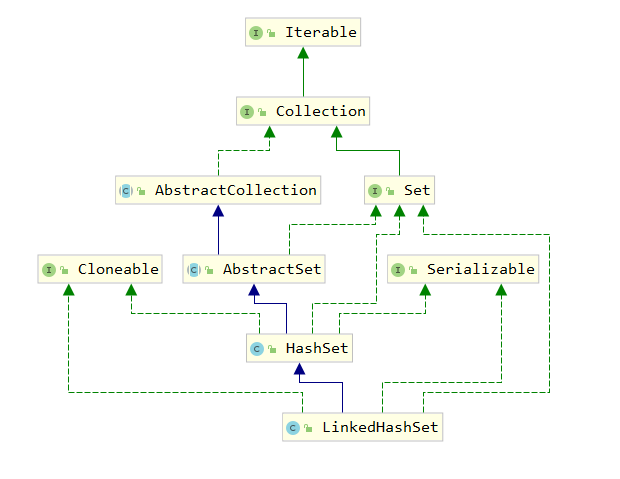

**`java.util.LinkedHashSet`** 类继承自 **`java.util.HashSet`** 抽象类，实现了 **`java.util.Set`**、**`java.lang.Cloneable`**、**`java.io.Serializable`** 接口。



<!-- more -->

## 一、LinkedHashSet特点或规范

**`java.util.LinkedHashSet`** 类是 **Set** 接口的 **哈希表** 和 **链表** 双实现，保证迭代顺序。

此实现与 HashSet 的不同之处在于它维护了一个双向链表。

注意，如果将已存在的元素重新插入到集合中，不会影响插入顺序。

---

## 二、构造器

### 空参构造器（遵循 Collection 接口规范）

调用父类构造器，使用 LinkedHashSet 实例，默认初始容量为 **16 **，默认加载因子为：**0.75**。
```java
public LinkedHashSet() {
    super(16, .75f, true);
}
```

### 参数为 Collection 类型的构造器（遵循 Collection 接口规范）

调用父类构造器，使用 LinkedHashMap 实例，初始容量为：集合的 **2倍**，默认加载因子为：**0.75**。
```java
public LinkedHashSet(Collection<? extends E> c) {
    super(Math.max(2*c.size(), 11), .75f, true);
    addAll(c);
}
```

### 指定初始容量和加载因子的构造器

构造一个空的 LinkedHashSet，调用父类构造器，使用 LinkedHashMap 实例，可指定 **初始容量** 和 **加载因子**。
```java
public LinkedHashSet(int initialCapacity, float loadFactor) {
    super(initialCapacity, loadFactor, true);
}
```

### 仅指定初始容量的构造器

构造一个空的 LinkedHashSet，调用父类构造器，使用 LinkedHashMap 实例，仅支持指定 **初始容量**，加载因子默认为：**0.75**。
```java
public LinkedHashSet(int initialCapacity) {
    super(initialCapacity, .75f, true);
}
```

---

## 三、其他方法

获得一个 **有序不可重复** 的分割器。
```java
public Spliterator<E> spliterator() {
    return Spliterators.spliterator(this, Spliterator.DISTINCT | Spliterator.ORDERED);
}
```
