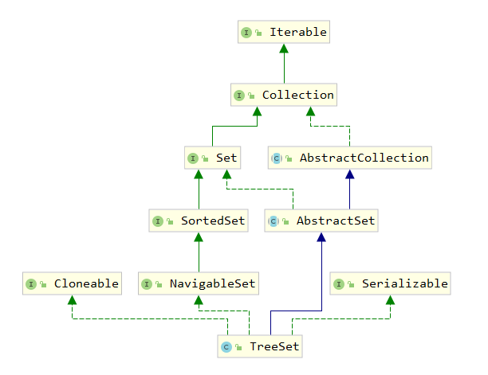

**`java.util.TreeSet`** 类继承自 **`java.util.AbstractSet`** 抽象类，实现了 **`java.util.NavigableSet`**、**`java.lang.Cloneable`**、**`java.io.Serializable`** 接口。



<!-- more -->

## 一、TreeSet特点或规范

**`TreeSet`** 是基于 **`java.util.TreeMap`** 的 **`java.util.NavigableSet`** 实现类。
- **有序**：元素按照其自然顺序排序，或在创建时指定比较器，具体实现取决于创建时调用的的构造函数。
- **不可重复**。

### 1.1 时间复杂度

TreeSet 的基本操作（**`add(Object)`**、**`remove(Object)`**、**`contains(Object)`**）均保证了时间复杂度为 **O(logN)**。

### 1.2 有序性保证

<font color="red">注意</font>：子类如果要正确实现 **Set** 接口，则由 **Set** 维护的排序（无论是否提供显式比较器）必须与 **equals()** 方法保持一致。
因为 **Set** 接口的唯一性是根据 **`equals()`** 方法决定的，而 **TreeSet** 是使用 **`compareTo()`** 方法实现元素比较。
TreeSet 实例即使排序与 equals() 方法不一致也是正确的，只是没有遵守 Set 接口规范。

### 1.3 线程不安全

<font color="red">注意</font>：**TreeSet 类线程不同步**。
如果多个线程同时访问 TreeSet，并且至少有一个线程修改了该 Set，则必须在外部进行同步。
实现同步的方法最好在创建 TreeSet 时完成，以防止对集合的意外不同步访问：

```java
SortedSet s = Collections.synchronizedSortedSet(new TreeSet(...));
```

### 1.4 并发迭代

如果在创建迭代器之后的任何时候修改了TreeSet，除了通过迭代器自己的 **`remove()`**方法之外，迭代器将抛出 **`ConcurrentModificationException`**。

---

## 二、成员变量

**TreeSet** 底层由 **TreeMap** 实现。
```java
private transient NavigableMap<E,Object> m;

// 关联 NavigableMap 中的 Object 虚拟值
private static final Object PRESENT = new Object();
```

---

## 三、构造器

### 空参构造器（遵循 Collection 接口规范）

使用 TreeMap 实例，比较器为默认自然排序。
```java
public TreeSet() {
    this(new TreeMap<E,Object>());
}
```

### 参数为 Collection 类型的构造器（遵循 Collection 接口规范）

使用 TreeMap 实例，比较器为默认自然排序。
```java
public TreeSet(Collection<? extends E> c) {
    this();
    addAll(c);
}
```

### 参数为 Comparator 类型的构造器

使用 TreeMap 实例，自定义比较器。
```java
public TreeSet(Comparator<? super E> comparator) {
    this(new TreeMap<>(comparator));
}
```

### 参数为 SortedSet 集合类型的构造器

使用 TreeSet 实例，使用参数 SortedSet 的比较器。
```java
public TreeSet(SortedSet<E> s) {
    this(s.comparator());
    addAll(s);
}
```

### 参数为 NavigableMap 类型的构造器

包访问权限，指定特定可导航的 Map 构造 TreeSet，用于子类扩展。
```java
TreeSet(NavigableMap<E,Object> m) {
    this.m = m;
}
```

---

## 四、方法分析

### 4.1 继承自 Set 接口的方法

```java
// 返回 map 中 keySet 的迭代器
public Iterator<E> iterator() {
    return m.navigableKeySet().iterator();
}

// 返回 set 的大小
public int size() {
    return m.size();
}

// 返回 set 是否为空
public boolean isEmpty() {
    return m.isEmpty();
}

// 返回 set 中是否包含元素 o
public boolean contains(Object o) {
    return m.containsKey(o);
}

// 添加元素 e，并返回是否成功
public boolean add(E e) {
    return m.put(e, PRESENT)==null;
}

// 删除元素 o，并返回是否删除成功
public boolean remove(Object o) {
    return m.remove(o)==PRESENT;
}

// 清空集合中的全部元素
public void clear() {
    m.clear();
}

// 添加集合，按照集合返回
public  boolean addAll(Collection<? extends E> c) {
    // 如果当前 set 集合中元素为空，使用集合 c 的比较器
    if (m.size() == 0 && c.size() > 0 && c instanceof SortedSet && m instanceof TreeMap) {
        SortedSet<? extends E> set = (SortedSet<? extends E>) c;
        TreeMap<E,Object> map = (TreeMap<E, Object>) m;
        Comparator<?> cc = set.comparator();
        Comparator<? super E> mc = map.comparator();
        if (cc == mc || (cc != null && cc.equals(mc))) {
            map.addAllForTreeSet(set, PRESENT);
            return true;
        }
    }
    // 调用 AbstractCollection 的方法，forEach循环依次添加
    return super.addAll(c);
}
```

### 4.2 继承自 SortedSet 接口的方法

获取第一个元素。
```java
public E first() {
    return m.firstKey();
}
```

获取最后一个元素。
```java
public E last() {
    return m.lastKey();
}
```

获取集合的比较器。
```java
public Comparator<? super E> comparator() {
    return m.comparator();
}
```

### 4.3 继承自 NavigableSet 接口的方法

#### 元素操作

返回 Set 中**大于**指定元素的**最小元素**，如果没有这样的元素，则返回 **`null`**。
```java
public E higher(E e) {
    return m.higherKey(e);
}
```

返回 Set 中**小于**指定元素的**最大元素**，如果没有这样的元素，则返回 **`null`**。
```java
public E lower(E e) {
    return m.lowerKey(e);
}
```

返回 Set 中**大于等于**指定元素的**最小元素**，如果没有这样的元素，则返回 **`null`**。
```java
public E ceiling(E e) {
    return m.ceilingKey(e);
}
```

返回 Set 中**小于等于**指定元素的**最大元素**，如果没有这样的元素，则返回 **`null`**。
```java
public E floor(E e) {
    return m.floorKey(e);
}
```

删除并返回第一个（最低）元素，如果 Set 为空，则返回 **`null`**。
```java
public E pollFirst() {
    Map.Entry<E,?> e = m.pollFirstEntry();
    return (e == null) ? null : e.getKey();
}
```

删除并返回最后一个（最高）元素，如果 Set 为空，则返回 **`null`**。
```java
public E pollLast() {
    Map.Entry<E,?> e = m.pollLastEntry();
    return (e == null) ? null : e.getKey();
}
```

#### 子集操作

返回 Set 的部分视图，其元素 **小于**（或 **等于**，如果 **inclusive** 为 **`true`**）**toElement**。
```java
public NavigableSet<E> headSet(E toElement, boolean inclusive) {
    return new TreeSet<>(m.headMap(toElement, inclusive));
}
```

返回 Set 的部分视图，其返回的元素 **小于toElement**。
```java
public SortedSet<E> headSet(E toElement) {
    return headSet(toElement, false);
}
```

返回 Set 的部分视图，其元素 **大于**（或 **等于**，如果 **inclusive** 为 **`true`**）**fromElement**。
```java
public NavigableSet<E> tailSet(E fromElement, boolean inclusive) {
    return new TreeSet<>(m.tailMap(fromElement, inclusive));
}
```

返回 Set 的部分视图，其返回的元素 **大于等于fromElement**。
```java
public SortedSet<E> tailSet(E fromElement) {
    return tailSet(fromElement, true);
}
```

返回 Set 的部分视图，其元素范围从 **fromElement** 到 **toElement**。如果 fromElement 和 toElement 相等，则返回的集合为空，除非 **fromInclusive** 和 **toInclusive** 都为 **`true`**。
```java
public NavigableSet<E> subSet(E fromElement, boolean fromInclusive,
                              E toElement, boolean toInclusive) {
    return new TreeSet<>(m.subMap(fromElement, fromInclusive, toElement, toInclusive));
}
```

返回 Set 的部分视图，其元素范围从 **fromElement（包括）** 到 **toElement（不包括）**。如果 fromElement 和 toElement 相等，则返回的集合为空。
```java
public SortedSet<E> subSet(E fromElement, E toElement) {
    return subSet(fromElement, true, toElement, false);
}
```

#### 倒序操作

返回 Set 中元素的 **逆序** 视图。降序集合由此集合支持，因此对集合的更改也将反映在降序集合中，反之亦然。
返回集合的顺序等同于 **`Collections.reverseOrder(comparator())`**。表达式 **`s.descendingSet().descendingSet()`** 返回集合等效于原集合 s。
```java
public NavigableSet<E> descendingSet() {
    return new TreeSet<>(m.descendingMap());
}
```

以 **降序** 返回此集合中元素的迭代器。
```java
public Iterator<E> descendingIterator() {
    return m.descendingKeySet().iterator();
}
```

### 4.4 继承自 Collection 接口的方法

获得 TreeMap 中的分割器。
```java
public Spliterator<E> spliterator() {
    return TreeMap.keySpliteratorFor(m);
}
```

### 4.5 其他方法

复制当前集合。
```java
public Object clone() {
    TreeSet<E> clone;
    try {
        clone = (TreeSet<E>) super.clone();
    } catch (CloneNotSupportedException e) {
        throw new InternalError(e);
    }
    clone.m = new TreeMap<>(m);
    return clone;
}
```

```java
private void writeObject(java.io.ObjectOutputStream s)
    throws java.io.IOException {
    // Write out any hidden stuff
    s.defaultWriteObject();
    // Write out Comparator
    s.writeObject(m.comparator());
    // Write out size
    s.writeInt(m.size());
    // Write out all elements in the proper order.
    for (E e : m.keySet())
        s.writeObject(e);
}
```

```java
private void readObject(java.io.ObjectInputStream s)
    throws java.io.IOException, ClassNotFoundException {
    // Read in any hidden stuff
    s.defaultReadObject();
    // Read in Comparator
    @SuppressWarnings("unchecked")
        Comparator<? super E> c = (Comparator<? super E>) s.readObject();
    // Create backing TreeMap
    TreeMap<E,Object> tm = new TreeMap<>(c);
    m = tm;
    // Read in size
    int size = s.readInt();
    tm.readTreeSet(size, s, PRESENT);
}
```
