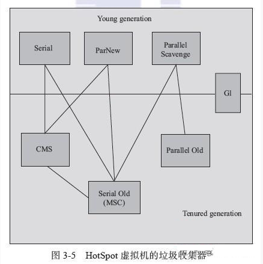
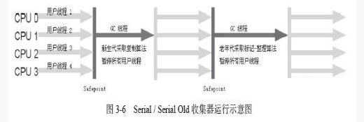
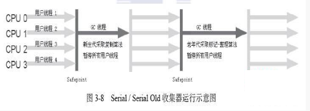
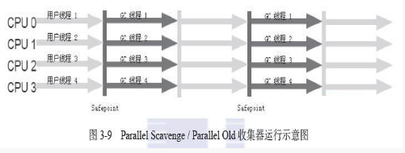
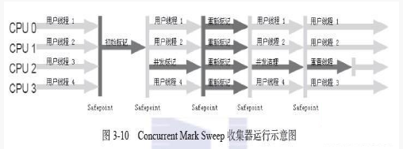

收集算法是内存回收的方法论，而 **垃圾收集器就是内存回收的具体实现** 。Java虚拟机规范中对垃圾收集器应该如何实现并没有任何规定，因此不同的厂商、不同版本的虚拟机所提供的垃圾收集器都可能会有很大差别，并且一般都会提供参数供用户根据自己的应用特点和要求组合出各个年代所使用的收集器。

<!-- more -->

这里讨论的收集器基于JDK 1.7 Update 14之后的HotSpot虚拟机（在这个版本中正式提供了商用的G1收集器，之前G1仍处于实验状态），这个虚拟机包含的所有收集器如所示。

**上图展示了7种作用于不同分代的收集器，如果两个收集器之间存在连线，就说明它们可以搭配使用。虚拟机所处的区域，则表示它是属于新生代收集器还是老年代收集器** 。

# Serial收集器

**Serial收集器是最基本、发展历史最悠久的收集器** ，曾经（在JDK 1.3.1之前）是虚拟机新生代收集的唯一选择。看名字就会知道， **这个收集器是一个单线程的收集器** ，但它的“单线程”的意义并不仅仅说明它只会使用一个CPU或一条收集线程去完成垃圾收集工作，更重要的是在它进行垃圾收集时，必须暂停其他所有的工作线程，直到它收集结束。“Stop The World”这个名字也许听起来很酷，但这项工作实际上是由虚拟机在后台自动发起和自动完成的，在用户不可见的情况下把用户正常工作的线程全部停掉，这对很多应用来说都是难以接受的。下图示意了Serial / Serial Old收集器的运行过程。

对于“Stop The World”带给用户的不良体验，虚拟机的设计者们表示完全理解，但也表示非常委屈：“你妈妈在给你打扫房间的时候，肯定也会让你老老实实地在椅子上或者房间外待着，如果她一边打扫，你一边乱扔纸屑，这房间还能打扫完？”这确实是一个合情合理的矛盾，虽然垃圾收集这项工作听起来和打扫房间属于一个性质的，但实际上肯定还要比打扫房间复杂得多！

从JDK 1.3开始，一直到现在最新的JDK 1.7，HotSpot虚拟机开发团队为消除或者减少工作线程因内存回收而导致停顿的努力一直在进行着，从Serial收集器到Parallel收集器，再到Concurrent Mark Sweep（CMS）乃至GC收集器的最前沿成果Garbage First（G1）收集器，我们看到了一个个越来越优秀（也越来越复杂）的收集器的出现，用户线程的停顿时间在不断缩短，但是仍然没有办法完全消除（这里暂不包括RTSJ中的收集器）。寻找更优秀的垃圾收集器的工作仍在继续！

写到这里，笔者似乎已经把Serial收集器描述成一个“老而无用、食之无味弃之可惜”的鸡肋了，但实际上到现在为止，它依然是虚拟机运行在Client模式下的默认新生代收集器。它也有着优于其他收集器的地方： **简单而高效** （与其他收集器的单线程比），对于限定单个CPU的环境来说，Serial收集器由于没有线程交互的开销，专心做垃圾收集自然可以获得最高的单线程收集效率。在用户的桌面应用场景中，分配给虚拟机管理的内存一般来说不会很大，收集几十兆甚至一两百兆的新生代（仅仅是新生代使用的内存，桌面应用基本上不会再大了），停顿时间完全可以控制在几十毫秒最多一百多毫秒以内，只要不是频繁发生，这点停顿是可以接受的。所以，Serial收集器对于运行在Client模式下的虚拟机来说是一个很好的选择。

# ParNew收集器

**ParNew收集器其实就是Serial收集器的多线程版本** ，除了使用多条线程进行垃圾收集之外，其余行为包括Serial收集器可用的所有控制参数（例如： **-XX:SurvivorRatio** 、 **-XX:PretenureSizeThreshold** 、 **-XX:HandlePromotionFailure** 等）、收集算法、Stop The World、对象分配规则、回收策略等都与Serial收集器完全一样，在实现上，这两种收集器也共用了相当多的代码。ParNew收集器的工作过程如图所示。

ParNew收集器除了多线程收集之外，其他与Serial收集器相比并没有太多创新之处，但 **它却是许多运行在Server模式下的虚拟机中首选的新生代收集器** ，其中有一个与性能无关但很重要的原因是，除了Serial收集器外， **目前只有它能与CMS收集器配合工作** 。

在JDK 1.5时期，HotSpot推出了一款在强交互应用中几乎可认为有划时代意义的垃圾收集器 —— **CMS收集器** （Concurrent Mark Sweep，本节稍后将详细介绍这款收集器），这款收集器是HotSpot虚拟机中第一款真正意义上的并发（Concurrent）收集器，它第一次实现了让垃圾收集线程与用户线程（基本上）同时工作，用前面那个例子的话来说，就是做到了在你的妈妈打扫房间的时候你还能一边往地上扔纸屑。

不幸的是，CMS作为老年代的收集器，却无法与JDK 1.4.0中已经存在的新生代收集器Parallel Scavenge配合工作，所以在JDK 1.5中使用CMS来收集老年代的时候，新生代只能选择ParNew或者Serial收集器中的一个。ParNew收集器也是使用-XX:+UseConcMarkSweepGC选项后的默认新生代收集器，也可以使用-XX:+UseParNewGC选项来强制指定它。

ParNew收集器在单CPU的环境中绝对不会有比Serial收集器更好的效果，甚至由于存在线程交互的开销，该收集器在通过超线程技术实现的两个CPU的环境中都不能百分之百地保证可以超越Serial收集器。当然，随着可以使用的CPU的数量的增加，它对于GC时系统资源的有效利用还是很有好处的。它默认开启的收集线程数与CPU的数量相同，在CPU非常多（譬如32个，现在CPU动辄就4核加超线程，服务器超过32个逻辑CPU的情况越来越多了）的环境下，可以使用-XX:ParallelGCThreads参数来限制垃圾收集的线程数。

注意　从ParNew收集器开始，后面还会接触到几款并发和并行的收集器。在大家可能产生疑惑之前，有必要先解释两个名词：并发和并行。这两个名词都是并发编程中的概念，在谈论垃圾收集器的上下文语境中，它们可以解释如下。

- **并行（Parallel）** ：指多条垃圾收集线程并行工作，但此时用户线程仍然处于等待状态。

- **并发（Concurrent）** ：指用户线程与垃圾收集线程同时执行（但不一定是并行的，可能会交替执行），用户程序在继续运行，而垃圾收集程序运行于另一个CPU上。

# Parallel Scavenge收集器

**Parallel Scavenge收集器是一个新生代收集器** ，它也是使用复制算法的收集器，又是并行的多线程收集器……看上去和ParNew都一样，那它有什么特别之处呢？

Parallel Scavenge收集器的特点是它的关注点与其他收集器不同，CMS等收集器的关注点是尽可能地缩短垃圾收集时用户线程的停顿时间，而Parallel Scavenge收集器的目标则是达到一个可控制的吞吐量（Throughput）。所谓吞吐量就是CPU用于运行用户代码的时间与CPU总消耗时间的比值，即 **吞吐量 = 运行用户代码时间 /（运行用户代码时间 + 垃圾收集时间** ），虚拟机总共运行了100分钟，其中垃圾收集花掉1分钟，那吞吐量就是99%。

停顿时间越短就越适合需要与用户交互的程序，良好的响应速度能提升用户体验，而高吞吐量则可以高效率地利用CPU时间，尽快完成程序的运算任务，主要适合在后台运算而不需要太多交互的任务。

Parallel Scavenge收集器提供了两个参数用于精确控制吞吐量，分别是控制最大垃圾收集停顿时间的-XX:MaxGCPauseMillis参数以及直接设置吞吐量大小的-XX:GCTimeRatio参数。

MaxGCPauseMillis参数允许的值是一个大于0的毫秒数，收集器将尽可能地保证内存回收花费的时间不超过设定值。不过大家不要认为如果把这个参数的值设置得稍小一点就能使得系统的垃圾收集速度变得更快，GC停顿时间缩短是以牺牲吞吐量和新生代空间来换取的：系统把新生代调小一些，收集300MB新生代肯定比收集500MB快吧，这也直接导致垃圾收集发生得更频繁一些，原来10秒收集一次、每次停顿100毫秒，现在变成5秒收集一次、每次停顿70毫秒。停顿时间的确在下降，但吞吐量也降下来了。

GCTimeRatio参数的值应当是一个大于0且小于100的整数，也就是垃圾收集时间占总时间的比率，相当于是吞吐量的倒数。如果把此参数设置为19，那允许的最大GC时间就占总时间的5%（即1 /（1+19）），默认值为99，就是允许最大1%（即1 /（1+99））的垃圾收集时间。

由于与吞吐量关系密切，Parallel Scavenge收集器也经常称为“吞吐量优先”收集器。除上述两个参数之外，Parallel Scavenge收集器还有一个参数-XX:+UseAdaptiveSizePolicy值得关注。这是一个开关参数，当这个参数打开之后，就不需要手工指定新生代的大小（-Xmn）、Eden与Survivor区的比例（-XX:SurvivorRatio）、晋升老年代对象年龄（-XX:PretenureSizeThreshold）等细节参数了，虚拟机会根据当前系统的运行情况收集性能监控信息，动态调整这些参数以提供最合适的停顿时间或者最大的吞吐量，这种调节方式称为GC自适应的调节策略（GC Ergonomics）。如果读者对于收集器运作原来不太了解，手工优化存在困难的时候，使用Parallel Scavenge收集器配合自适应调节策略，把内存管理的调优任务交给虚拟机去完成将是一个不错的选择。只需要把基本的内存数据设置好（如-Xmx设置最大堆），然后使用MaxGCPauseMillis参数（更关注最大停顿时间）或GCTimeRatio（更关注吞吐量）参数给虚拟机设立一个优化目标，那具体细节参数的调节工作就由虚拟机完成了。自适应调节策略也是Parallel Scavenge收集器与ParNew收集器的一个重要区别。

# Serial Old收集器

**Serial Old是Serial收集器的老年代版本，它同样是一个单线程收集器，使用“标记－整理”算法** 。这个收集器的主要意义也是在于给Client模式下的虚拟机使用。如果在Server模式下，那么它主要还有两大用途：一种用途是在JDK 1.5以及之前的版本中与Parallel Scavenge收集器搭配使用，另一种用途就是作为CMS收集器的后备预案，在并发收集发生Concurrent Mode Failure时使用。这两点都将在后面的内容中详细讲解。Serial Old收集器的工作过程如图所示。

# Parallel Old收集器

**Parallel Old是Parallel Scavenge收集器的老年代版本，使用多线程和“标记－整理”算法** 。这个收集器是在JDK 1.6中才开始提供的，在此之前，新生代的Parallel Scavenge收集器一直处于比较尴尬的状态。原因是，如果新生代选择了Parallel Scavenge收集器，老年代除了Serial Old（PS MarkSweep）收集器外别无选择（还记得上面说过Parallel Scavenge收集器无法与CMS收集器配合工作吗？）。由于老年代Serial Old收集器在服务端应用性能上的“拖累”，使用了Parallel Scavenge收集器也未必能在整体应用上获得吞吐量最大化的效果，由于单线程的老年代收集中无法充分利用服务器多CPU的处理能力，在老年代很大而且硬件比较高级的环境中，这种组合的吞吐量甚至还不一定有ParNew加CMS的组合“给力”。

直到Parallel Old收集器出现后，“吞吐量优先”收集器终于有了比较名副其实的应用组合，在注重吞吐量以及CPU资源敏感的场合，都可以优先考虑Parallel Scavenge加Parallel Old收集器。Parallel Old收集器的工作过程如图所示。

# CMS收集器

**CMS（Concurrent Mark Sweep）收集器是一种以获取最短回收停顿时间为目标的收集器** 。目前很大一部分的Java应用集中在互联网站或者B/S系统的服务端上，这类应用尤其重视服务的响应速度，希望系统停顿时间最短，以给用户带来较好的体验。CMS收集器就非常符合这类应用的需求。
从名字（包含“Mark Sweep”）上就可以看出， **CMS收集器是基于“标记—清除”算法实现的** ，它的运作过程相对于前面几种收集器来说更复杂一些，整个过程分为 **4个步骤** ，包括：
- **初始标记** （CMS initial mark）
- **并发标记** （CMS concurrent mark）
- **重新标记** （CMS remark）
- **并发清除** （CMS concurrent sweep）

其中， **初始标记、重新标记这两个步骤仍然需要“Stop The World”** 。 **初始标记** 仅仅只是标记一下GC Roots能直接关联到的对象，速度很快，并发标记阶段就是进行GC Roots Tracing的过程，而 **重新标记** 阶段则是为了修正并发标记期间因用户程序继续运作而导致标记产生变动的那一部分对象的标记记录，这个阶段的停顿时间一般会比初始标记阶段稍长一些，但远比并发标记的时间短。

由于整个过程中耗时最长的并发标记和并发清除过程收集器线程都可以与用户线程一起工作，所以，从总体上来说， **CMS收集器的内存回收过程是与用户线程一起并发执行的** 。通过下图可以比较清楚地看到CMS收集器的运作步骤中并发和需要停顿的时间。

CMS是一款优秀的收集器，它的主要优点在名字上已经体现出来了： **并发收集** 、 **低停顿** ，Sun公司的一些官方文档中也称之为 **并发低停顿收集器** （Concurrent Low Pause Collector）。但是CMS还远达不到完美的程度，它有以下3个明显的 **缺点** ：

**CMS收集器对CPU资源非常敏感** 。其实，面向并发设计的程序都对CPU资源比较敏感。在并发阶段，它虽然不会导致用户线程停顿，但是会因为占用了一部分线程（或者说CPU资源）而导致应用程序变慢，总吞吐量会降低。 **CMS默认启动的回收线程数是（CPU数量+3）/ 4，也就是当CPU在4个以上时，并发回收时垃圾收集线程不少于25%的CPU资源，并且随着CPU数量的增加而下降** 。但是当CPU不足4个（譬如2个）时，CMS对用户程序的影响就可能变得很大，如果本来CPU负载就比较大，还分出一半的运算能力去执行收集器线程，就可能导致用户程序的执行速度忽然降低了50%，其实也让人无法接受。为了应付这种情况，虚拟机提供了一种称为“ **增量式并发收集器** ”（Incremental Concurrent Mark Sweep / i-CMS）的CMS收集器变种，所做的事情和单CPU年代PC机操作系统使用抢占式来模拟多任务机制的思想一样，就是在并发标记、清理的时候让GC线程、用户线程交替运行，尽量减少GC线程的独占资源的时间，这样整个垃圾收集的过程会更长，但对用户程序的影响就会显得少一些，也就是速度下降没有那么明显。实践证明，增量时的CMS收集器效果很一般，在目前版本中，i-CMS已经被声明为“deprecated”，即不再提倡用户使用。

**CMS收集器无法处理浮动垃圾** （Floating Garbage），可能出现“Concurrent Mode Failure”失败而导致另一次Full GC的产生。由于CMS并发清理阶段用户线程还在运行着，伴随程序运行自然就还会有新的垃圾不断产生，这一部分垃圾出现在标记过程之后，CMS无法在当次收集中处理掉它们，只好留待下一次GC时再清理掉。这一部分垃圾就称为“ **浮动垃圾** ”。也是由于在垃圾收集阶段用户线程还需要运行，那也就还需要预留有足够的内存空间给用户线程使用，因此CMS收集器不能像其他收集器那样等到老年代几乎完全被填满了再进行收集，需要预留一部分空间提供并发收集时的程序运作使用。在JDK 1.5的默认设置下，CMS收集器当老年代使用了68%的空间后就会被激活，这是一个偏保守的设置，如果在应用中老年代增长不是太快，可以适当调高参数 **-XX:CMSInitiatingOccupancyFraction** 的值来提高触发百分比，以便降低内存回收次数从而获取更好的性能，在JDK 1.6中，CMS收集器的启动阈值已经提升至92%。要是CMS运行期间预留的内存无法满足程序需要，就会出现一次“Concurrent Mode Failure”失败，这时虚拟机将启动后备预案：临时启用Serial Old收集器来重新进行老年代的垃圾收集，这样停顿时间就很长了。所以说参数-XX:CMSInitiatingOccupancyFraction设置得太高很容易导致大量“Concurrent Mode Failure”失败，性能反而降低。

还有最后一个缺点，在本节开头说过，CMS是一款基于“标记—清除”算法实现的收集器，如果读者对前面这种算法介绍还有印象的话，就可能想到这意味着 **收集结束时会有大量空间碎片产生** 。空间碎片过多时，将会给大对象分配带来很大麻烦，往往会出现老年代还有很大空间剩余，但是无法找到足够大的连续空间来分配当前对象，不得不提前触发一次Full GC。为了解决这个问题，CMS收集器提供了一个 **-XX:+UseCMSCompactAtFullCollection** 开关参数（默认就是开启的），用于在CMS收集器顶不住要进行FullGC时开启内存碎片的合并整理过程，内存整理的过程是无法并发的，空间碎片问题没有了，但停顿时间不得不变长。虚拟机设计者还提供了另外一个参数 **-XX:CMSFullGCsBeforeCompaction** ，这个参数是用于设置执行多少次不压缩的Full GC后，跟着来一次带压缩的（默认值为0，表示每次进入Full GC时都进行碎片整理）。

# G1收集器

G1（Garbage-First）收集器是当今收集器技术发展的最前沿成果之一，早在JDK 1.7刚刚确立项目目标，Sun公司给出的JDK 1.7 RoadMap里面，它就被视为JDK 1.7中HotSpot虚拟机的一个重要进化特征。从JDK 6u14中开始就有Early Access版本的G1收集器供开发人员实验、试用，由此开始G1收集器的“Experimental”状态持续了数年时间，直至JDK 7u4，Sun公司才认为它达到足够成熟的商用程度，移除了“Experimental”的标识。

**_G1是一款面向服务端应用的垃圾收集器_** 。HotSpot开发团队赋予它的使命是（在比较长期的）未来可以替换掉JDK 1.5中发布的CMS收集器。与其他GC收集器相比，G1具备如下 **特点** 。

**并行与并发** ：G1能充分利用多CPU、多核环境下的硬件优势，使用多个CPU（CPU或者CPU核心）来缩短Stop-The-World停顿的时间，部分其他收集器原本需要停顿Java线程执行的GC动作，G1收集器仍然可以通过并发的方式让Java程序继续执行。

**分代收集** ：与其他收集器一样，分代概念在G1中依然得以保留。虽然G1可以不需要其他收集器配合就能独立管理整个GC堆，但它能够采用不同的方式去处理新创建的对象和已经存活了一段时间、熬过多次GC的旧对象以获取更好的收集效果。

**空间整合** ：与CMS的“标记—清理”算法不同，G1从整体来看是基于“标记—整理”算法实现的收集器，从局部（两个Region之间）上来看是基于“复制”算法实现的，但无论如何，这两种算法都意味着G1运作期间不会产生内存空间碎片，收集后能提供规整的可用内存。这种特性有利于程序长时间运行，分配大对象时不会因为无法找到连续内存空间而提前触发下一次GC。

**可预测的停顿** ：这是G1相对于CMS的另一大优势，降低停顿时间是G1和CMS共同的关注点，但G1除了追求低停顿外，还能建立可预测的停顿时间模型，能让使用者明确指定在一个长度为M毫秒的时间片段内，消耗在垃圾收集上的时间不得超过N毫秒，这几乎已经是实时Java（RTSJ）的垃圾收集器的特征了。

在G1之前的其他收集器进行收集的范围都是整个新生代或者老年代，而G1不再是这样。使用G1收集器时，Java堆的内存布局就与其他收集器有很大差别，它将整个Java堆划分为多个大小相等的独立区域（Region），虽然还保留有新生代和老年代的概念，但 **新生代和老年代不再是物理隔离的了，它们都是一部分Region（不需要连续）的集合** 。

G1收集器之所以能建立可预测的停顿时间模型，是因为它可以有计划地避免在整个Java堆中进行全区域的垃圾收集。 **G1跟踪各个Region里面的垃圾堆积的价值大小（回收所获得的空间大小以及回收所需时间的经验值），在后台维护一个优先列表，每次根据允许的收集时间，优先回收价值最大的Region** （这也就是Garbage-First名称的来由）。这种使用Region划分内存空间以及有优先级的区域回收方式，保证了G1收集器在有限的时间内可以获取尽可能高的收集效率。

G1把内存“化整为零”的思路，理解起来似乎很容易，但其中的实现细节却远远没有想象中那样简单，否则也不会从2004年Sun实验室发表第一篇G1的论文开始直到今天（将近10年时间）才开发出G1的商用版。笔者以一个细节为例：把Java堆分为多个Region后，垃圾收集是否就真的能以Region为单位进行了？听起来顺理成章，再仔细想想就很容易发现问题所在：Region不可能是孤立的。一个对象分配在某个Region中，它并非只能被本Region中的其他对象引用，而是可以与整个Java堆任意的对象发生引用关系。那在做可达性判定确定对象是否存活的时候，岂不是还得扫描整个Java堆才能保证准确性？这个问题其实并非在G1中才有，只是在G1中更加突出而已。在以前的分代收集中，新生代的规模一般都比老年代要小许多，新生代的收集也比老年代要频繁许多，那回收新生代中的对象时也面临相同的问题，如果回收新生代时也不得不同时扫描老年代的话，那么Minor GC的效率可能下降不少。

**在G1收集器中，Region之间的对象引用以及其他收集器中的新生代与老年代之间的对象引用，虚拟机都是使用Remembered Set来避免全堆扫描的** 。G1中每个Region都有一个与之对应的Remembered Set，虚拟机发现程序在对Reference类型的数据进行写操作时，会产生一个Write Barrier暂时中断写操作，检查Reference引用的对象是否处于不同的Region之中（在分代的例子中就是检查是否老年代中的对象引用了新生代中的对象），如果是，便通过CardTable把相关引用信息记录到被引用对象所属的Region的Remembered Set之中。当进行内存回收时，在GC根节点的枚举范围中加入Remembered Set即可保证不对全堆扫描也不会有遗漏。

如果不计算维护Remembered Set的操作， **G1收集器的运作大致可划分为以下几个步骤** ：
- **初始标记** （Initial Marking）
- **并发标记** （Concurrent Marking）
- **最终标记** （Final Marking）
- **筛选回收** （Live Data Counting and Evacuation）

对CMS收集器运作过程熟悉的读者，一定已经发现G1的前几个步骤的运作过程和CMS有很多相似之处。 **初始标记** 阶段仅仅只是标记一下GC Roots能直接关联到的对象，并且修改TAMS（Next Top at Mark Start）的值，让下一阶段用户程序并发运行时，能在正确可用的Region中创建新对象，这阶段需要停顿线程，但耗时很短。 **并发标记** 阶段是从GC Root开始对堆中对象进行可达性分析，找出存活的对象，这阶段耗时较长，但可与用户程序并发执行。而最终标记阶段则是为了修正在并发标记期间因用户程序继续运作而导致标记产生变动的那一部分标记记录，虚拟机将这段时间对象变化记录在线程Remembered Set Logs里面，最终标记阶段需要把Remembered Set Logs的数据合并到Remembered Set中，这阶段需要停顿线程，但是可并行执行。最后在 **筛选回收** 阶段首先对各个Region的回收价值和成本进行排序，根据用户所期望的GC停顿时间来制定回收计划，从Sun公司透露出来的信息来看，这个阶段其实也可以做到与用户程序一起并发执行，但是因为只回收一部分Region，时间是用户可控制的，而且停顿用户线程将大幅提高收集效率。通过下图可以比较清楚地看到G1收集器的运作步骤中并发和需要停顿的阶段。

