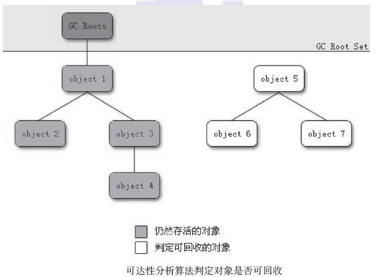

**在Java各内存区域中，程序计数器、虚拟机栈、本地方法区3个区域随线程而生，随线程而灭，这几个区域的内存分配和垃圾回收都具有确定性**，这几个区域内就不需要过多的考虑回收的问题，因为方法结束或者线程结束时，内存自然就跟随着回收了。我们只需要考虑Java堆和方法区中的内存即可。

<!-- more -->

# 对象回收算法

## 1.引用计数算法

给对象中添加一个引用计数器，每当有一个地方引用它时，计数器值就加1；当引用失效时，引用器值就减1；任何时刻计数器为0点对象就是不可能再被使用的。

**但至少主流的Java虚拟机里没有选用引用计数算法来管理内存** ，其中最主要的原因是它很难解决对象之间相互循环引用的问题。

## 2.可达性分析算法

在主流的商用程序语言（Java、C#，甚至包括古老的Lisp）的主流实现中， **都是称通过可达性分析（Reachability Analysis）来判定对象是否存活的**。这个算法的基本思路就是通过一系列的称为“ **GC Roots** ”的对象作为起始点，从这些节点开始向下搜索，搜索所走过的路径称为 **引用链** （Reference Chain），当一个对象到GC Roots没有任何引用链相连（用图论的话来说，就是从GC Roots到这个对象不可达）时，则证明此对象是不可用的。如图所示，对象object 5、object 6、object 7虽然互相有关联，但是它们到GC Roots是不可达的，所以它们将会被判定为是可回收的对象。

### 在Java语言中，可作为GC Roots的对象包括下面几种：
- 虚拟机栈（栈帧中的本地变量表）中引用的对象。
- 方法区中类静态属性引用的对象。
- 方法区中常量引用的对象。
- 本地方法栈中JNI（即一般说的Native方法）引用的对象。

# 对象的四种引用

无论是通过引用计数算法判断对象的引用数量，还是通过可达性分析算法判断对象的引用链是否可达，判定对象是否存活都与“ **引用** ”有关。

在JDK 1.2以前，Java中的引用的定义很传统：如果reference类型的数据中存储的数值代表的是另外一块内存的起始地址，就称这块内存代表着一个引用。这种定义很纯粹，但是太过狭隘，一个对象在这种定义下只有被引用或者没有被引用两种状态，对于如何描述一些“食之无味，弃之可惜”的对象就显得无能为力。我们希望能描述这样一类对象：当内存空间还足够时，则能保留在内存之中；如果内存空间在进行垃圾收集后还是非常紧张，则可以抛弃这些对象。很多系统的缓存功能都符合这样的应用场景。

在JDK 1.2之后，Java对引用的概念进行了扩充，将引用分为**强引用（Strong Reference）、软引用（Soft Reference）、弱引用（Weak Reference）、虚引用（Phantom Reference）** 4种，这4种引用强度依次逐渐减弱 。

* 强引用:
就是指在程序代码之中普遍存在的， **类似 `Object obj = new Object()` 这类的引用，只要强引用还存在，垃圾收集器永远不会回收掉被引用的对象** 。

* 软引用:
是用来描述一些 **还有用但并非必需的对象** 。对于软引用关联着的对象，在系统将要发生内存溢出异常之前，将会把这些对象列进回收范围之中进行第二次回收。如果这次回收还没有足够的内存，才会抛出内存溢出异常。在JDK 1.2之后，提供了SoftReference类来实现软引用。

* 弱引用:
也是用来描述 **非必需对象** 的，但是它的强度比软引用更弱一些，被弱引用关联的对象只能生存到下一次垃圾收集发生之前。当垃圾收集器工作时，无论当前内存是否足够，都会回收掉只被弱引用关联的对象。在JDK 1.2之后，提供了WeakReference类来实现弱引用。

* 虚引用:
也称为幽灵引用或者幻影引用，它是最弱的一种引用关系。 **一个对象是否有虚引用的存在，完全不会对其生存时间构成影响，也无法通过虚引用来取得一个对象实例** 。为一个对象设置虚引用关联的唯一目的就是能在这个对象被收集器回收时收到一个系统通知。在JDK 1.2之后，提供了PhantomReference类来实现虚引用。

# 对象回收时的自我拯救

**即使在可达性分析算法中不可达的对象，也并非是“非死不可”的**，这时候它们暂时处于“缓刑”阶段，要真正宣告一个对象死亡，至少要经历两次标记过程：
- **如果对象在进行可达性分析后发现没有与GC Roots相连接的引用链，那它将会被第一次标记并且进行一次筛选，筛选的条件是此对象是否有必要执行finalize()方法。当对象没有覆盖finalize()方法，或者finalize()方法已经被虚拟机调用过，虚拟机将这两种情况都视为“没有必要执行”** 。

- 如果这个对象被判定为有必要执行 **finalize()** 方法，那么这个对象将会放置在一个叫做**F-Queue** 的队列之中，并在稍后由一个由虚拟机自动建立的、低优先级的Finalizer线程去执行它。这里所谓的“执行”是指虚拟机会触发这个方法，但并不承诺会等待它运行结束，这样做的原因是，如果一个对象在finalize()方法中执行缓慢，或者发生了死循环（更极端的情况），将很可能会导致F-Queue队列中其他对象永久处于等待，甚至导致整个内存回收系统崩溃。 **finalize()方法是对象逃脱死亡命运的最后一次机会** ，稍后GC将对F-Queue中的对象进行第二次小规模的标记，如果对象要在finalize()中成功拯救自己，只要重新与引用链上的任何一个对象建立关联即可，譬如把自己（this关键字）赋值给某个类变量或者对象的成员变量，那在第二次标记时它将被移除出“即将回收”的集合；如果对象这时候还没有逃脱，那基本上它就真的被回收了。

**任何一个对象的finalize()方法都只会被系统自动调用一次，如果对象面临下一次回收，它的finalize()方法不会被再次执行** 。finalize()能做的所有工作，使用try-finally或者其他方式都可以做得更好、更及时。不建议使用此方法。

# 回收方法区

很多人认为方法区（或者HotSpot虚拟机中的永久代）是没有垃圾收集的，Java虚拟机规范中确实说过可以不要求虚拟机在方法区实现垃圾收集，而且在方法区中进行垃圾收集的“性价比”一般比较低：在堆中，尤其是在新生代中，常规应用进行一次垃圾收集一般可以回收70%～95%的空间，而永久代的垃圾收集效率远低于此。

永久代（JDK1.8之前版本）的垃圾收集主要回收两部分内容：**废弃常量和无用的类** 。回收废弃常量与回收Java堆中的对象非常类似。以常量池中字面量的回收为例，假如一个字符串“abc”已经进入了常量池中，但是当前系统没有任何一个String对象是叫做“abc”的，换句话说，就是没有任何String对象引用常量池中的“abc”常量，也没有其他地方引用了这个字面量，如果这时发生内存回收，而且必要的话，这个“abc”常量就会被系统清理出常量池。 **常量池中的其他类（接口）、方法、字段的符号引用也与此类似** 。

判定一个常量是否是“废弃常量”比较简单，而要判定一个类是否是“无用的类”的条件则相对苛刻许多。 **类需要同时满足下面3个条件才能算是“无用的类”** ：

> 1.该类所有的实例都已经被回收，也就是Java堆中不存在该类的任何实例。
> 2.加载该类的ClassLoader已经被回收。
> 3.该类对应的java.lang.Class 对象没有在任何地方被引用，无法在任何地方通过反射访问该类的方法。

虚拟机可以对满足上述3个条件的无用类进行回收，这里说的仅仅是“可以”，而并不是和对象一样，不使用了就必然会回收。

是否对类进行回收，HotSpot虚拟机提供了 **-Xnoclassgc** 参数进行控制，还可以使用 **-verbose:class** 以及 **-XX:+TraceClassLoading** **-XX:+TraceClassUnLoading** 查看类加载和卸载信息，其中 **-verbose:class** 和 **-XX:+TraceClassLoading** 可以在Product版的虚拟机中使用， **-XX:+TraceClassUnLoading** 参数需要FastDebug版的虚拟机支持。

在大量使用反射、动态代理、CGLib等ByteCode框架、动态生成JSP以及OSGi这类频繁自定义ClassLoader的场景都需要虚拟机具备类卸载的功能，以保证永久代不会溢出。
