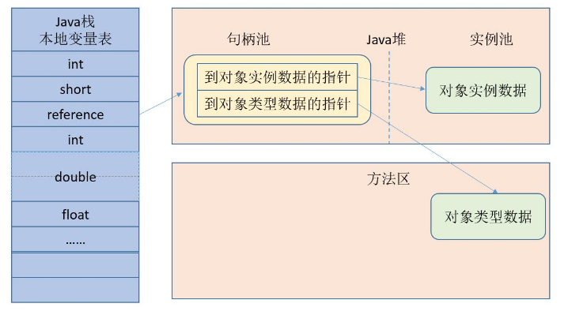
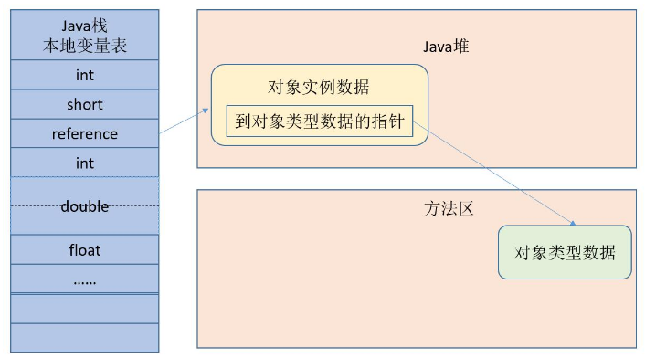

虚拟机内部细节，各虚拟机厂商的实现略有差异，因此以主流的Oracle HotSpot虚拟机为例分析。

<!-- more -->

# 1、对象的创建

Java是一门面向对象的编程语言，在语言层面上，创建对象（例如克隆，反序列化）通常仅仅是一个new关键字而已，而在虚拟机中，对象（进限于普通Java对象，不包括数组和Class对象等）的创建过程为：

**加载相应的类** ：当虚拟机遇到一条new指令时，首先将去检查这个指令的参数是否能在常量池中定位到一个类的符号引用，并且检查这个符号引用的类是否已被加载、解析和初始化过。如果没有，则必须先执行响应的类的加载过程。

**分配内存** ：对象所需内存的大小在类加载完成后便可完全确定。此过程等同于为把一块确定大小的内存从Java堆中划分出来。划分方法主要有 **指针碰撞** 和 **空闲列表** 两种分配方式，而选择哪种方式由Java堆内存是否规整决定，Java堆是否规整又由所采用的垃圾收集器是否带有压缩整理功能决定。

## a、指针碰撞
如果Java堆中内存是绝对规整的，所有用过的内存都放在一边，未使用的内存放在另一边，中间放着一个指针作为分界点的指示器，那所分配内存就仅仅是把那个指针指向空闲空间那边挪动一段与对象大小相等的距离。

## b、空闲列表
如果Java堆中的内存并不是规整的，已使用的内存和未使用的内存相互交错，就无法使用指针碰撞了，虚拟机必须维护一个列表来记录哪些内存是可用的，在分配的时候从列表中找到一块足够大的空间划分给对象实例，并更新表上的记录。

 **后续工作**：内存分配完成后，虚拟机需要将分配到的内存空间初始化为零值(不包括对象头)，然后再对对象进行必要的设置（主要是对象头信息的设置）。此时，在虚拟机看来一个新的对象已经产生了，但是从程序员的角度来看，对象创建才刚刚开始，需要执行 **&lt;init&gt;** 方法，把对象按照程序员的意愿进行初始化。

# 2、对象的内存划分
在HotSpot虚拟机中，对象在内存中存储的布局分为3块区域： **对象头**（Header）、 **实例数据**（Instance Data）和 **对齐填充**（Padding）。

## 对象头信息：
包括两部分信息（平均分配），第一部分用于存储对象自身的运行时数据，如哈希吗、GC分代年龄、锁状态标志、线程持有的锁、偏向线程ID、偏向时间戳等，这部分数据的长度在32位和64位的虚拟机（未开启压缩指针）中分别为32bit和64bit，官方称为“Mark Work”。对象头的另一部分是类型指针，即对象指向它的类元数据的指针，虚拟机通过这个指针来确定这个对象是哪个类的实例。另外，如果对象是一个Java数组，那在对象头中还必须有一块用于记录数组长度的数据。

## 实例数据：
是对象真正的存储的有效信息，也是在程序中所定义的各种类型的字段内容。无论是从父类中继承下来的，还是在子类中定义的，都需要记录下来。
存储顺序会受到分配策略参数和字段在Java源码中定义顺序的影响。HotSpot虚拟机默认的分配策略为longs/doubles、ints、shorts/chars、bytes/booleans、oop（Ordinary Object Pointers），相同宽度的字段总是被分配到一起。在满足这个前提条件下，在父类中定义的变量会出现在子类之前。如果CompactFields参数值为true（默认为true），那么子类之中较窄的变量也可能会插入到父类变量的空隙之中。

## 对齐填充：
并不是必然存在的，也没有特别的含义，仅仅起着占位符的作用。而HotSpot VM的自动内存管理系统要求对象的大小必须是8字节的整数倍。对象头部分正好是8字节的倍数（1倍或者2倍），因此当对象实例数据部分没有对齐时，就需要对齐填充来补充。

# 3、对象的访问定位
 **Java程序需要通过栈上的引用数据来操作堆上的具体对象**。对象的访问方式取决于虚拟机实现，目前主流的访问方式有使用句柄和直接指针两种。

## 句柄：
可以理解为指向指针的指针（句柄池，也在堆中），维护指向对象的指针变化，而对象的句柄本身不发生变化。

**优势** ：引用中存储的是稳定的句柄地址，在对象被移动（垃圾收集时移动对象是非常普遍的行为）时只会改变句柄中的实例数据指针，而引用本身不需要修改。

## 指针：
指向对象，代表对象的内存地址。如果使用直接指针访问，那么Java堆对象的布局中就必须考虑如何放置访问类型数据的相关信息，而 **引用中存储的直接就是对象地址** 。

**优势** ：速度更快，节省了一次指针定位的时间开销。由于对象的访问在Java中非常频繁，因此这类开销积少成多后也是非常可观的执行成本。

**HotSpot虚拟机使用第二种方式进行对象访问。** 
