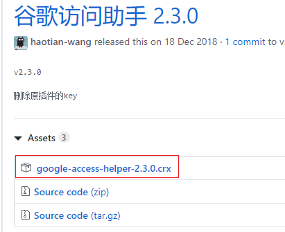
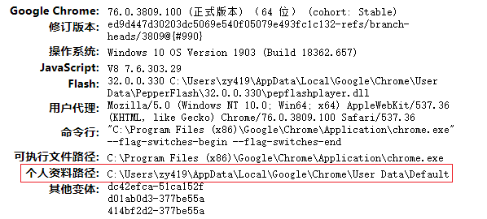
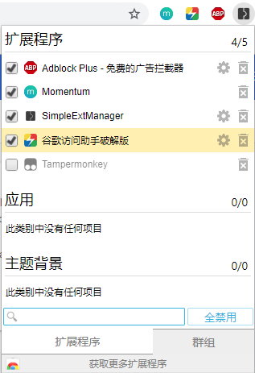
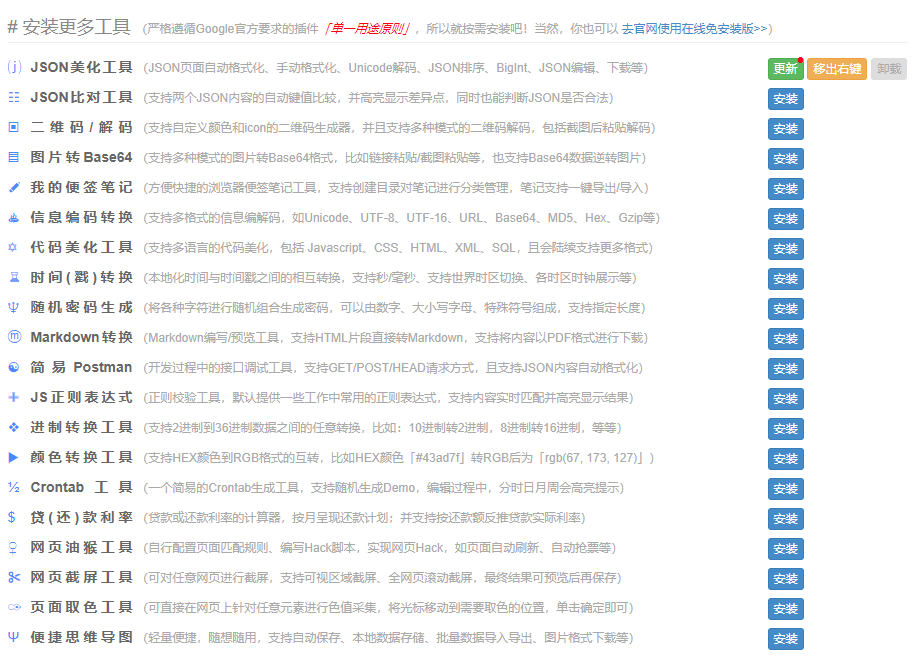

## 一、必备

#### Momentum：美化

#### 谷歌访问助手：[https://github.com/haotian-wang/google-access-helper/](https://github.com/haotian-wang/google-access-helper/)

<!-- more -->

1. 打开后点击 **releases**，下载最新的 crx 扩展文件。

2. 下载后修改后缀名为rar，并解压为文件夹，最好放在chrome扩展文件目录下，此目录不可删除，否则插件无法使用。
chrome扩展文件目录位置：在浏览器地址栏中输入：chrome://version/

3. 打开扩展程序，选择【加载已解压的扩展程序】，成功后即可访问google搜索。

#### AdblockPlus：广告拦截

#### Toby for Chrome 或 Toby Mini（推荐）：保存已打开的标签页。

#### SimpleExtManager：即时打开或关闭可用插件，避免消耗内存。

#### 图片助手：批量下载图片

教程：[http://www.pullywood.com/publish/imageassistant-resource-list](http://www.pullywood.com/publish/imageassistant-resource-list)

#### 达达划词翻译：双击弹窗翻译，支持发音。

---

## 二、程序员必备

#### FeHelper.JSON：程序员开发组合工具集。

#### Octotree：github扩展插件，文件访问跳转利器。

#### GitZip for github：单独下载某一个或多个文件，不必下载全部zip包。
