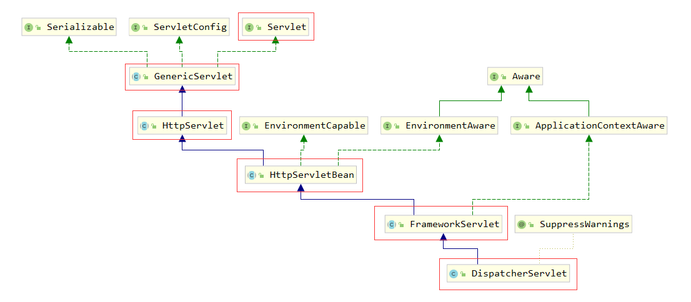
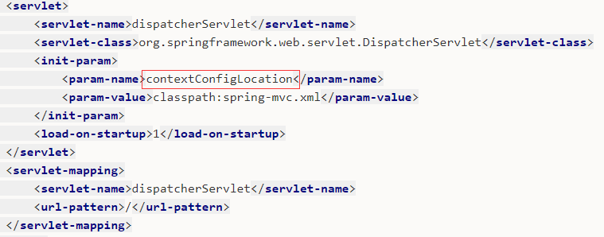

## 一、SpringMVC入口

SpringMVC启动类为：**`org.springframework.web.servlet.DispatcherServlet`**

<!-- more -->

由此可以看出 **DispatcherServlet** 本质上是继承自 **`javax.servlet.Servlet`** 顶级接口，因此其生命周期为：**`init() --> service() --> destory()`**。

继承关系如下：

- **`javax.servlet.Servlet`** 
  - **`javax.servlet.GenericServlet`**
    - **`javax.servlet.http.HttpServlet`**
      - **`org.springframework.web.servlet.HttpServletBean`**
        - **`org.springframework.web.servlet.FrameworkServlet`**
          - **`org.springframework.web.servletDispatcherServlet`**
  

所以，SpringMVC启动时，是由 servlet容器（tomcat）调用执行 **`init()`** 方法，而 **`HttpServletBean`** 中覆盖了 **`init()`**方法，并 **`final`** 修饰，**`DispatcherServlet`** 和 **`FrameworkServlet`** 中都无法再继续覆盖，因此启动时会调用 **`HttpServletBean.init()`** 方法。

---

## 二、init()方法，对初始化过程进行处理

init() 方法执行过程大概分为三步：

方法")

### 1.设置web.xml中的配置参数

**`ServletConfigPropertyValues`** 是 **`HttpServletBean`** 的内部静态类，构造过程中会使用 **`ServletConfig`** 对象找出 web.xml 配置文件中的配置参数并设置到 **`ServletConfigPropertyValues`** 中。

### 2.初始化BeanWrapper

使用 **`BeanWrapper`** 来构造实例化 **`DispatcherServlet`** 对象（即：this当前对象），接着通过当前 this 对象的 **`getServletContext()`** 方法获取 servlet 上下文信息，并创建 **`ServletContextResourceLoader`** 对象，给 **bw** 注册 **`Resource`** 类型的属性编辑器，然后调用 **`initBeanWrapper()`** 进行初始化（空方法，供子类进行扩展），初始化后，给 bw 对象设置属性值，即 web.xml 中配置的参数值。

### 3.调用initServletBean()方法

空方法，供子类进行扩展。

**如**：web.xml 中的 **`contextConfigLocation`** 参数，使用 **`BeanWrapper`** 构造，会将这个属性注入到子类 **`FrameworkServlet`** 的 **`contextConfigLocation`** 属性中，因为HttpServletBean中并没有定义该属性。

---

## 三、FrameworkServlet中进行初始化

由于 HttpServletBean 中的 **`initServletBean()`** 方法为空方法，**`FrameworkServlet`** 中对其进行**覆写**：

方法")

SpringMVC启动时的几行日志即为此处输出，此方法重点关注 **try代码块** 中的代码。

此处代码分为两部分：

- <a href="#3_1">初始化WebApplicationContext</a>
- <a href="#3_2">初始化initFrameworkServlet</a>

### <a name="3_1">1.初始化WebApplicationContext</a>

方法")

- 第一段代码：初始化 **`webApplicationContext`** 属性，**`WebApplicationContext`** 是继承自 **`ApplicationContext`** 接口的子接口，该属性也就是 **Spring容器上下文**。

  **FrameworkServlet 的作用就是将 Servlet 与 Spring 容器关联**。**`WebApplicationContextUtils.getWebApplicationContext(getServletContext())`** 得到根上下文。

- 第二段代码：DispatcherServlet 有一个以 **WebApplicationContext** 为参数的构造方法，当使用有 WebApplicationContext 参数的构造方法进行构造时执行第二段代码。

- 第三段代码：如果 WebApplicationContext 对象（**wac**）为空，则以 contextAttribute 属性（FrameworkServlet 中的 String 类型的 contextAttribute 属性）为key，在 ServletContext 中找到的 WebApplicationContext 对象。

- 第四段代码：如果 WebApplicationContext 对象仍然为空， 则创建 WebApplicationContext 并设置 **根上下文（容器）** 为 **父上下文（父容器）**，然后配置 ServletConfig、ServletContext 等实例到这个上下文中。

- 第五段代码：**`onRefresh(wac)`** 为模板方法，WebApplicationContext 创建成功后会进行调用，在 FrameworkServlet 中为空方法，在 **子类 DispatcherServlet 中会覆写此方法**。

- 第六段代码：将 WebApplicationContext 以参数的形式发布（设置）到 ServletContext 中。

### <a name="3_2">2.初始化initFrameworkServlet</a>

**`initFrameworkServlet()`** 方法并没有做任何处理，该方法主要是为了让子类覆写该方法并做一些需要处理的事情，但DispatcherServlet并未覆写该方法。

方法")

注意：

**根上下文** 是 web.xml 中配置的 **ContextLoaderListener监听器** 中根据 **`contextConfigLocation`** 路径生成的上下文。

例如：以下这段配置文件中是根据 **`classpath:spring-mvc.xml`** 下的 xml 文件生成的根上下文。

---

## 四、DispatcherServlet初始化各种接口的实现类

DispatcherServlet 覆写了 FrameworkServlet 中的 **`onRefresh()`** 方法。

**`initStrategies()`** 方法内部会初始化各个 **策略接口的实现类**。

- 异常处理初始化 **`initHandlerExceptionResolvers(context)`** 方法：SpringMVC异常处理机制。
- 视图处理初始化 **`initViewResolvers(context)`** 方法：SpringMVC视图机制。
- 请求映射处理初始化 **`initHandlerMappings(context)`** 方法：详解SpringMVC请求的时候是如何找到正确的Controller。

方法")

---

## 五、总结各个Servlet的作用

1. **HttpServletBean**
    主要做一些初始化的工作，将 web.xml 中配置的参数设置到 Servlet 中。比如 servlet 标签的子标签 init-param 标签中配置的参数。
2. **FrameworkServlet**
    将 Servlet 与 Spring 容器上下文关联。其实也就是初始化 FrameworkServlet 的属性 webApplicationContext，这个属性代表 SpringMVC 上下文，它有个父类上下文，既 web.xml 中配置的 ContextLoaderListener 监听器初始化的容器上下文。
3. **DispatcherServlet**
    初始化各个功能的实现类。比如异常处理、视图处理、请求映射处理等。

---

## 六、DispatcherServlet处理请求过程

### 1.doGet()方法

首先，当 HTTP 请求到 Servle t后，HttpServlet 提供了 service() 方法用于处理请求，service方法使用了模板方法设计模式，在内部对于 http 的 get 请求（或其他请求）会调用 doGet() 方法，SpringMVC 在 FrameworkServlet 中对 doGet() 方法进行了覆盖，在其方法内部调用了 **`processRequest(request, response)`** 方法。

方法")

### 2.processRequest()方法

进入 **`processRequest()`** 方法，得到与当前请求线程绑定的 LocalContext 和 ServletRequestAttributes 对象，然后执行 **`initContextHolders()`** 方法，让新构造的 LocalContext 和 ServletRequestAttributes 与当前请求线程绑定（通过ThreadLocal完成）。

方法")

### 3.doService()方法

DispatcherServlet覆写的 **`doService()`**方法：

方法")

在 **`doService()`** 方法中判断，如果该请求是 include 请求，那么保存一份快照版本的 request 域中的请求参数，doDispatch() 方法结束后，这个快照版本的数据将会覆盖新的 request 域中的数据。最终请求到 **`doDispatch()`** 方法。

### 4.doDispatch()方法

方法")

首先根据请求的路径找到 HandlerMethod（带有 Method 反射属性，也就是对应 Controller 中的方法），然后匹配路径对应的拦截器，有了 HandlerMethod 和拦截器构造个 HandlerExecutionChain 对象。

HandlerExecutionChain 对象的获取是通过 HandlerMapping 接口提供的方法中得到。有了 HandlerExecutionChain 之后，通过 HandlerAdapter 对象进行处理得到 ModelAndView 对象，HandlerMethod 内部 handle 的时候，使用各种 HandlerMethodArgumentResolver 实现类处理 HandlerMethod 的参数，使用各种 HandlerMethodReturnValueHandler 实现类处理返回值。

最终返回值被处理成 ModelAndView 对象，这期间发生的异常会被 HandlerExceptionResolver 接口实现类进行处理。

---

## 七、总结

本文分析了 SpringMVC 的入口 Servlet -> DispatcherServlet 的作用，其中分析了父类 HttpServletBean 以及 FrameworkServlet 的作用。SpringMVC 的设计与 Struts2 完全不同，Struts2 采取的是一种完全和 web 容器隔离的解耦的机制，而 SpringMVC 就是基于最基本的 request 和 response 进行设计的。
