# 一. 为什么要使用 Spring

## 1. 什么是控制翻转（IOC）？

- IOC：Inversion of control，控制翻转，是一种设计思想

## 2. 控制翻转的几种方式？

1. 依赖注入（DI：Dependency Injection）
2. 依赖查找（DL：Dependency Lookup）
3. 依赖拖拽（DP：Dependency Pull）

## 3. 为什么要面向抽象接口编程？

1. 解耦
2. 方便代理

## 4. Spring 编程风格

1. Schame-based
2. Annotation-based
3. JavaConfig-based
4. AspectJ-based

---

# 二. 注入 Bean 的方式

## 1. XML 配置文件（目前此方式过时）

spring.xml 定义 bean 标签

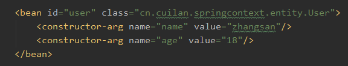

getBean

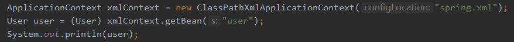

## 2. JavaConfig+@Bean（可以注入第三方的类）

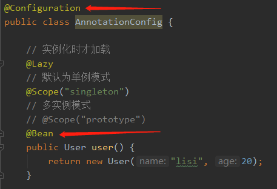

创建 JavaConfig 类，添加 **@Configuration** 注解，标识这是一个配置类，在方法上添加 **@Bean** 注解，即完成注入。

## 3. ComponentScan 包扫描+Spring 四种注解（局限于仅自己写的类）

### 1) Spring 四种注入组件的注解

- i. @Controller
- ii. @Service
- iii. @Repository
- iv. @Component

### 2) @ComponentScan 注解：

- i. **value**：等价于 basePackages 定义该注解扫描的包。
- ii. **basePackages**：等价于 value，定义该注解扫描的包。
- iii. **excludeFilters**：定义需要排除的包。
- iv. **includeFilters**：定义需要制定包含的包，使用这个属性，必须禁用默认的过滤器，useDefaultFilters=false
- v. **useDefaultFilters**：制定是否使用默认的过滤器，默认为 ture

### 3) @ComponentScans 注解:

可包含多个 **@ComponentScan** 注解，JDK1.8 以后的版本可以定义多个@ComponentScan，该注解主要为 JDK1.8 之前的版本使用。

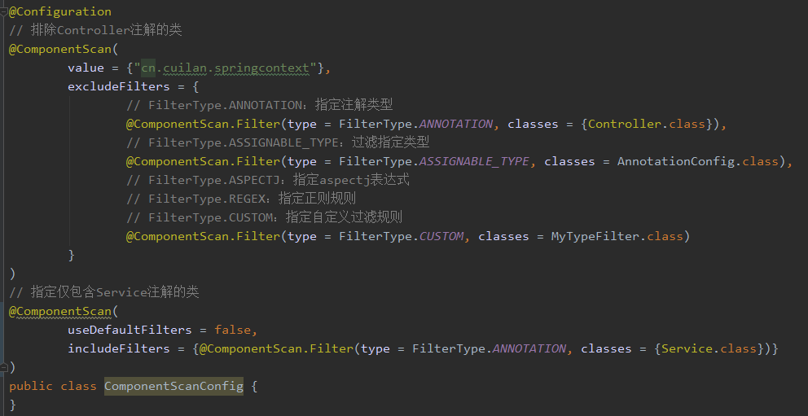

### 4) @ComponentScan.Filter 注解

- i. **type**：过滤类型
  - a) FilterType.**ANNOTATION**：指定注解类型。
  - b) FilterType.**ASSIGNABLE_TYPE**：过滤指定类型。
  - c) FilterType.**ASPECTJ**：指定 aspectj 表达式。
  - d) FilterType.**REGEX**：指定正则规则。
  - e) FilterType.**CUSTOM**：指定自定义过滤规则：使用自定义过滤器需要创建类并实现 **TypeFilter** 接口。
- ii. **classes**：用于 ANNOTATION、ASSIGNABLE_TYPE、CUSTOM 三种过滤类型，指定类。
- iii. **pattern**：表达式，用于 ASPECTJ、REGEX 匹配。

## 4. Import（可快速给容器中导入组件）

### 1) @Import(要导入的组件)：容器就会自动注册这个组件，id 默认为全类名。

ImportConfig

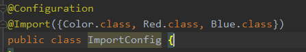

### 2) ImportSelector：返回需要导入的组件的全类名数组。

ImportConfig

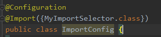

MyImportSelector

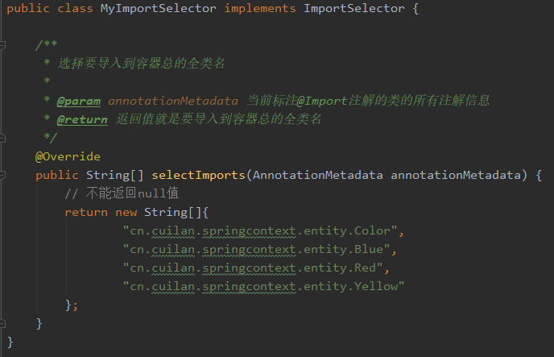

### 3) ImportBeanDefinitionRegistrar：手动注册 Bean 到容器中

ImportConfig

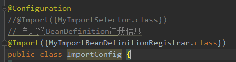

MyImportBeanDefinitionRegistrar

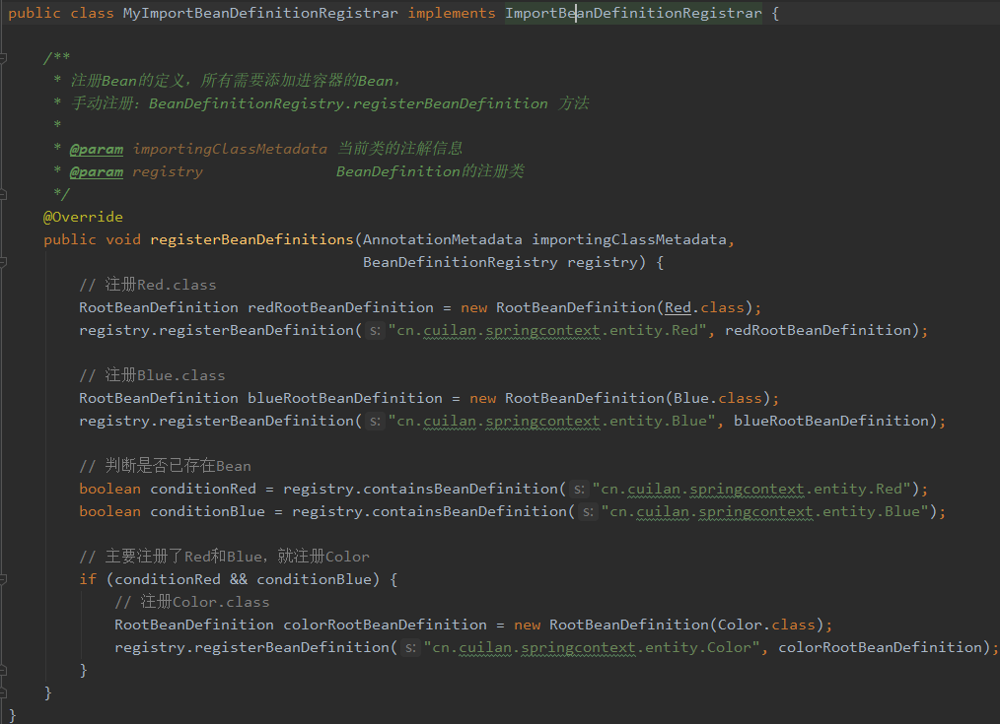

## 5. FactoryBean（注册工厂 Bean）

FactoryBean

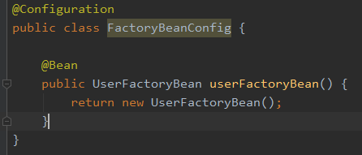
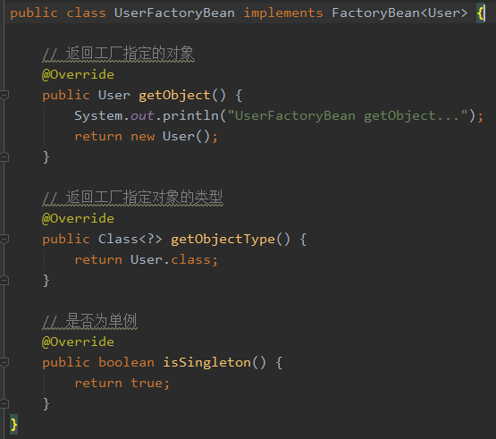

**注意** ：根据以上 Bean 名称获取到的对象是 User 对象，

```java
Object user = context.getBean("userFactoryBean");
```

如果需要拿到工厂对象，需要在 Bean 的名称前面加 **&**：

```java
Object userFactoryBean = context.getBean("&userFactoryBean");
```

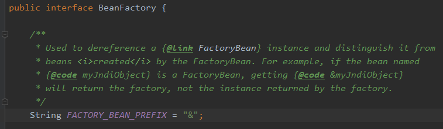
