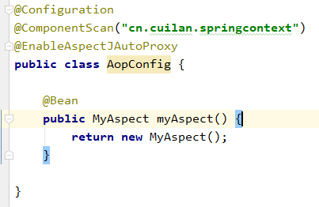
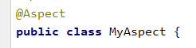
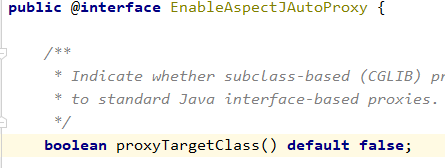

# 一. 什么是 AOP？

AOP（Aspect Oriented Programming）面向切面编程，是相对 OOP 而言的，AOP 关注的是切面，是程序的横切点通用性问题，不会对主业务造成影响，是对传统 OOP 编程的补充扩展，以非侵入的方式对程序进行增强补充，实现业务与通用性问题的解耦，如记录日志、事务管理，性能监控等。

# 二. AOP 概念

## 1. 术语

- Aspect：切面
- Join point：连接点，在 SpringAOP 中，连接点始终代表方法的执行
- Advice：通知
- Pointcut：切点（连接点的集合），SpringAOP 默认使用 AspectJ 切入表达式
- Introduction：类型间声明
- Target object：目标对象
- AOP proxy：代理对象
- Weaving：织入

## 2. 通知类型

- 前置通知
- 后置通知
- 环绕通知

# 三. SpringAOP 对 AspectJ 的支持

## 1. 启用@AspectJ 支持

@EnableAspectJAutoProxy



@Aspect



## 2. 声明切点

### i. execution：最细粒度匹配

```java
execution(modifiers-pattern? ret-type-pattern declaring-type-pattern?.name-pattern(param-pattern) throws throws-pattern?)
```

- a) modifiers-pattern?：访问控制权限，可以省略
- b) ret-type-pattern：返回值类型，通常为：\*
- c) declaring-type-pattern：类型，全包名，可以省略
- d) name-pattern：方法名称
- e) param-pattern：参数类型及名称
- f) throws-pattern?：异常类型，可以省略

### ii. within：较粗粒度匹配，仅能实现到包和接口、类级别

```java
within(declaring-type-pattern?.name-pattern)
```

### iii. args：匹配指定参数

```java
args(param-pattern)
```

### iv. this：匹配代理对象

```java
this(param-pattern)
```

SpringAOP 默认使用的是 JDK 的 Proxy 代理（基于聚合接口实现），proxyTargetClass 默认为 false，表示不使用 CGLIB 代理目标类，所以使用 this 匹配到的是代理对象，无法为目标对象实现增强功能。改为 true 则使用 CGLIB 代理（动态代理），此时 this 匹配的才是被代理对象。



### v. target：匹配被代理对象

```java
target(param-pattern)
```

目标对象无论使用什么代理都可以匹配到。

### vi. @target：匹配带有 XXX 注解的目标类

### vii. @args：匹配带有 XXX 注解的参数

### viii. @within：匹配带有 XXX 注解的类，支持表达式，效果等同于@target

### ix. @annotation：匹配所有带有 XXX 注解的类、方法等

# 四. 环绕通知

## 1. 声明环绕通知：

```java
@Around("execution(* cn.cuilan.*.*(..))")
```

## 2. ProceedingJoinPoint 与 JoinPoint

- JoinPoint 是切入点对象，ProceedingJoinPoint 是可继续执行的切入点对象
- ProceedingJoinPoint 继承自 JoinPoint
