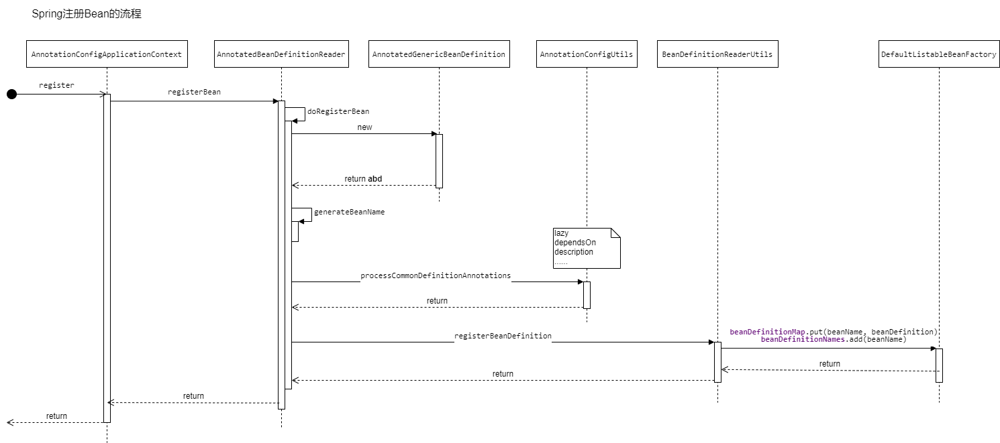

# 一、register 方法

register 方法既可以注册普通 Bean，也可以将一个 JavaConfig 配置类作为 Bean 来注册。

```java
// 注册普遍Bean
context.register(Test.class);

public AnnotationConfigApplicationContext(Class<?>... componentClasses) {
	// 先调用当前类的构造器，初始化BeanDefinition的读取器、扫描器
	this();
	// 注册配置类，本身也作为一个BeanDefinition被注册
	register(componentClasses);
	// 刷新方法
	refresh();
}
```

# 二、准备 BeanDefinition

```java
private <T> void doRegisterBean(Class<T> beanClass, @Nullable String name,
								@Nullable Class<? extends Annotation>[] qualifiers, @Nullable Supplier<T> supplier,
								@Nullable BeanDefinitionCustomizer[] customizers) {

    // 创建注解生成的BeanDefinition
	AnnotatedGenericBeanDefinition abd = new AnnotatedGenericBeanDefinition(beanClass);
	// 判断是否需要跳过注册
	if (this.conditionEvaluator.shouldSkip(abd.getMetadata())) {
		return;
	}

	abd.setInstanceSupplier(supplier);
	ScopeMetadata scopeMetadata = this.scopeMetadataResolver.resolveScopeMetadata(abd);
	// 设置Scope，单例或原型
	abd.setScope(scopeMetadata.getScopeName());
	// 生成bean的名称，BeanNameGenerator接口，自定义Bean名称生成策略可以实现该接口
	String beanName = (name != null ? name : this.beanNameGenerator.generateBeanName(abd, this.registry));

    // 注解配置静态工具类，处理通用BeanDefinition的注解
	AnnotationConfigUtils.processCommonDefinitionAnnotations(abd);
	if (qualifiers != null) {
		for (Class<? extends Annotation> qualifier : qualifiers) {
			if (Primary.class == qualifier) {
				abd.setPrimary(true);
			} else if (Lazy.class == qualifier) {
				abd.setLazyInit(true);
			} else {
				abd.addQualifier(new AutowireCandidateQualifier(qualifier));
			}
		}
	}
	if (customizers != null) {
		for (BeanDefinitionCustomizer customizer : customizers) {
			customizer.customize(abd);
		}
	}

	// 将BeanDefinition对象、bean名称，封装成BeanDefinitionHolder对象
	BeanDefinitionHolder definitionHolder = new BeanDefinitionHolder(abd, beanName);
	// 应用作用域代理模式
	definitionHolder = AnnotationConfigUtils.applyScopedProxyMode(scopeMetadata, definitionHolder, this.registry);
	// 注册BeanDefinition，this.registry = GenericApplicationContext
	BeanDefinitionReaderUtils.registerBeanDefinition(definitionHolder, this.registry);
}
```

## 1. 创建 BeanDefinition

## 2. 设置 Scope，单例或原型等

## 3. 生成 Bean 的名称

可实现 BeanNameGenerator 接口，自定义 Bean 名称生成策略可以实现该接口。

## 4. 设置 Bean 的属性

注解配置静态工具类，处理通用 BeanDefinition 的注解，懒加载、是否为主类、设置依赖、设置权限、描述等信息。

```java
AnnotationConfigUtils.processCommonDefinitionAnnotations(abd);

static void processCommonDefinitionAnnotations(AnnotatedBeanDefinition abd, AnnotatedTypeMetadata metadata) {
	// 判断是否懒加载
	AnnotationAttributes lazy = attributesFor(metadata, Lazy.class);
	if (lazy != null) {
		abd.setLazyInit(lazy.getBoolean("value"));
	} else if (abd.getMetadata() != metadata) {
		lazy = attributesFor(abd.getMetadata(), Lazy.class);
		if (lazy != null) {
			abd.setLazyInit(lazy.getBoolean("value"));
		}
	}
	// 是否为主类
	if (metadata.isAnnotated(Primary.class.getName())) {
		abd.setPrimary(true);
	}
	// 设置依赖
	AnnotationAttributes dependsOn = attributesFor(metadata, DependsOn.class);
	if (dependsOn != null) {
		abd.setDependsOn(dependsOn.getStringArray("value"));
	}
	// 设置权限
	AnnotationAttributes role = attributesFor(metadata, Role.class);
	if (role != null) {
		abd.setRole(role.getNumber("value").intValue());
	}
	// 设置描述
	AnnotationAttributes description = attributesFor(metadata, Description.class);
	if (description != null) {
		abd.setDescription(description.getString("value"));
	}
}
```

## 5. 注册 BeanDefinition

BeanDefinitionHolder 仅仅是对 BeanDefinition 与 BeanName 的封装，registry 当前是 `DefaultListableBeanFactory`。

```java
public static void registerBeanDefinition(
		BeanDefinitionHolder definitionHolder, BeanDefinitionRegistry registry)
		throws BeanDefinitionStoreException {

	// Register bean definition under primary name.
	String beanName = definitionHolder.getBeanName();
	// 注册BeanDefinition，registry -> GenericApplicationContext
	registry.registerBeanDefinition(beanName, definitionHolder.getBeanDefinition());

	// 处理Bean的别名
	// Register aliases for bean name, if any.
	String[] aliases = definitionHolder.getAliases();
	if (aliases != null) {
		for (String alias : aliases) {
			registry.registerAlias(beanName, alias);
		}
	}
}
```

## 6. DefaultListableBeanFactory 的核心注册方法

- 首先，从 IOC 核心容器 **`beanDefinitionMap`** 中获取 Bean，防止重复注册。

```java
// 判断是否已存在，防止重复注册
BeanDefinition existingDefinition = this.beanDefinitionMap.get(beanName);
```

- 放入 IOC 核心容器

```java
// 放入IOC核心容器
this.beanDefinitionMap.put(beanName, beanDefinition);
```

- 容量自增，并将原先的所有的 Bean 放入其中，再将当前 Bean 放入其中，保证注册顺序。

```java
// 容量自增
List<String> updatedDefinitions = new ArrayList<>(this.beanDefinitionNames.size() + 1);
// 将原先的beanDefinitionNames全部放入
updatedDefinitions.addAll(this.beanDefinitionNames);
// 将beanName单独放入ArrayList，保证注册顺序
updatedDefinitions.add(beanName);
this.beanDefinitionNames = updatedDefinitions;
```
