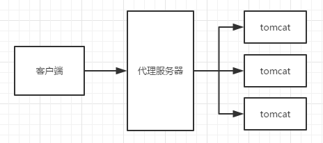
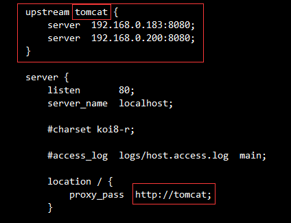
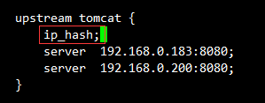
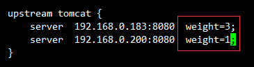
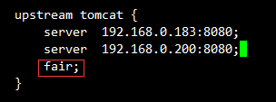
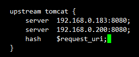

# 一、Nginx 的反向代理



## 优势

1. 隔离内部服务器，提高安全性。
2. 可以在代理服务器上增加缓存，减少后端服务器的压力，提高性能。
3. 方便横向扩展。
4. AIO（异步非阻塞）动静分离，提高性能。

<!--more-->

## 反向代理配置

```perl
location / {
    proxy_pass http://www.baidu.com;
}

# proxy_pass [可以是 IP、IP:port 或 域名]
location /cuilan {
    proxy_set_header Host $host;
    proxy_set_header X-Real-IP $remote_addr;
    proxy_set_header X-Forwarded-For $http_x_forwarded_for;
    proxy_pass http://192.168.0.200:8080;
}
```

# 二、Nginx 的负载均衡

目前主流的负载均衡器：**Nginx、LVS、HAProxy**

## upstream

upstream 是 nginx 服务器的一个重要模块，upstream 模块实现在轮询客户端 IP 之间实现后端的负载均衡，**ip_hash 算法**。

## 配置负载均衡

修改 **nginx.conf**

### 1.轮询

无法保证 session。

```
upstream xxx {
    server ip:port;
    server ip:port;
}
```



### 2.ip_hash

访问固定的一台后端服务器，可以保证 session。


### 3.权重(weight)

分配轮询的比重，weight 值越高，访问的几率越大，权重值跟请求几率成正比。


### 4.响应时间

响应时间最短的优先分配。


### 5.url_hash

根据 url 计算来确定访问哪台主机，配置 hash。


# 三、进程模型及工作原理

Master/Worker 进程模型

## Master 进程

1. 接受外界的信号：kill -QUIT / kill -HUP
2. 向各个 Worker 进程发送信号。
3. 监控 Worker 的运行状态。
4. 当 Worker 进程因异常退出，会自动重新启动新的 Worker 进程。

## Worker 进程

1. 处理客户端请求。
2. 同步锁。

## Nginx 模块

1. 核心模块：**http 模块、event 模块、mail 模块**
2. 基础模块
3. 第三方模块

# 四、Nginx + keepalived 实现高可用

keepalived：基于 VRRP（虚拟路由器冗余器）来实现对 web 服务的高可用方案。

## 安装 keepalived

1. 下载 **keepalived**，并解压： **`tar -zxvf keepalived-1.3.4.tar.gz`**
2. 配置：

```bash
#keepalived启动时会默认读取/etc/keepalived/keepalived.conf配置文件。
./configure --prefix=/usr/soft/keepalived/keepalived-1.3.4-bin/ --sysconf=/etc/
```

依赖 OpenSSL，安装 OpenSSL：

```bash
sudo yum install openssl-devel
```

3. **make && make install**
4. 建立软连接(安装路径下)：

```bash
sudo ln -s /usr/soft/keepalived/keepalived-1.3.5-bin/sbin/keepalived /sbin/
```

5. 复制启动脚本，配置服务（源码包下）：

```bash
sudo cp /usr/soft/keepalived/keepalived-1.3.5/keepalived/etc/init.d/keepalived /etc/init.d/
```

6. 将配置添加入服务（CentOS 下）：

```bash
sudo chkconfig --add keepalived
chkconfig keepalived on
# 启动服务
sudo service keepalived start
```

## **keepalived 配置文件**

```bash
global_defs { (全局配置，配置告警邮件服务器)
    router_id LVS_DEVEL (唯一识别id)
}
vrrp_instance VI_1 {       (VRRP实例)
    state MASTER / BACKUP  (设置主从)
    interface eth0         (设置网卡，通过ifconfig命令查看)
    virtual_router_id 51   (虚拟路由器id)
    priority 100           (设置权重，大的为Master)
    virtual_ipaddress {    (设置对外的虚拟ip)
        192.168.0.100
    }
}
vrrp_script chk_nginx_service { (vrrp_script指定检测脚本，对应名称自定义)
    script "/usr/soft/nginx/nginx-1.10.3-bin/sbin/nginx_service.sh"
    interval 3
    weight -10
}
virtual_server 192.168.0.100 80 {   (LVS配置，映射VRRP虚拟ip)
    real_server 192.168.0.200 80 {  (真实服务器地址)
    weight 1                        (权重)
    TCP_GET {                       (TCP连接)
        connect_timeout 3           (连接超时时间)
        nb_get_retry 3
        delay_before_retry 3
        connect_port 80             (重新连接监听的端口)
    }
    }
    track_script {                  (配置检测nginx的脚本，指向vrrp_script)
        chk_nginx_service
    }
}
```

## nginx_service.sh

nginx 安装目录下的检测 nginx 运行状态的脚本（nginx_service.sh）

```bash
#!/bin/bash
PATH=/bin:/sbin:/usr/bin:/usr/sbin
A=`ps -C nginx --no-header | wc -l`
if [ $A -eq 0 ]
then
echo 'nginx service is died'
service keepalived stop
fi
```
