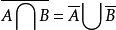
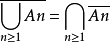
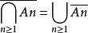

## 基本定律：

**幂等律**：A∪A = A，A∩A = A
**交换律**：A∪B = B∪A，A∩B = B∩A
**结合律**：(A∪B)∪C = A∪(B∪C)，(A∩B)∩C = A∩(B∩C)
**分配律**：A∩(B∪C) = (A∩B)∪(A∩C)，A∪(B∩C) = (A∪B)∩(A∪C)

## De·Morgan（德·摩根）定律：

非(A 且 B) = 非 A 或非 B

非(A 或 B) = 非 A 且非 B

<!--more-->

**例如**：设 A，B，C 为三个随机事件，用 A，B，C 的运算关系表示下列各事件：

1. 只有 A 发生：
   A∩ 非 B∩ 非 C（表示：A 发生，并且 B 不发生，并且 C 也不发生）

2. A 发生：A

3. A，B，C 都发生：
   A∩B∩C = ABC（表示：A 发生，并且 B 发生，并且 C 也发生）

4. A，B，C 至少一个发生：
   A∪B∪C（表示：A 发生，或者 B 发生，或者 C 发生）

5. A，B，C 都不发生：
   非 A∩ 非 B∩ 非 C（表示：A 不发生，并且 B 不发生，并且 C 也不发生）

6. A，B，C 不多于一个发生：
   非 A∩ 非 B∩ 非 C ∪ A∩ 非 B∩ 非 C ∪ 非 A∩B∩ 非 C ∪ 非 A∩ 非 B∩C（表示：ABC 都不发生，或者 ABC 三个事件只发生一个）

7. A，B，C 不多于两个发生：
   非 A∩ 非 B∩ 非 C ∪ A∩ 非 B∩ 非 C ∪ 非 A∩B∩ 非 C ∪ 非 A∩ 非 B∩C ∪ A∩B∩ 非 C ∪ A∩ 非 B∩C ∪ 非 A∩B∩C = 非 A∪ 非 B∪ 非 C（表示：ABC 都不发生，或者 ABC 三个事件只发生一个，或者 ABC 三个事件只发生两个；就等于 A 不发生，或者 B 不发生，或者 C 不发生）

8. A，B，C 至少有两个发生：
   A∩B∩ 非 C ∪ A∩ 非 B∩C ∪ 非 A∩B∩C ∪ A∩B∩C = A∩B ∪ A∩C ∪ B∩C（表示：ABC 三个事件只发生两个，或者 ABC 三个事件都发生；就等于 AB 发生，或者 AC 发生，或者 BC 发生）
